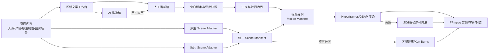

# 导出演示讲解视频 2.0 完整升级实施计划

> **状态：** P0 核心链路和 M1 原生 Scene Adapter 已实现；M2 的真实 TTS 时序、Scene Bundle、Motion、页面级三级回退与最终渲染快照已完成代码接线，真实音视频、关键帧一致性和安装包烟雾测试仍待验收  
> **制定日期：** 2026-07-25  
> **最近升级：** 2026-07-26，正式 Windows 包已修复共享 schema 缺失与失效 DPAPI 密钥阻断启动，干净便携包后端健康且生产默认启用 Hyperframes/Image Scene；真实 TTS、外部 OCR/Inpaint 和完整导出 E2E 仍待验收  
> **目标版本：** 视频文案工作台 + Edge/Fish Audio 双引擎旁白 + 原生/图片统一动画渲染  
> **权威 UI 规范：** `docs/UI_RULES.md`  
> **实施原则：** 复用现有旁白、TTS、任务中心和 FFmpeg 链路，不新增第二套导出产品。

## 一、执行摘要

本计划把“导出演示讲解视频”升级为一条可控、可恢复、可验证的内容生产链路，而不是在导出按钮后临时拼接文案、语音和静态图片。

最终产品由两个共享模块组成：

1. **视频文案工作台**：用户可逐页或全项目编辑文案，支持单人和双人分段，AI 负责首次生成、润色和结构调整，但只能创建候选稿，不能静默覆盖人工稿。
2. **统一动画导演与渲染链路**：原生模式直接使用结构化 DOM 元素；图片模式升级为可分层的混合场景；两种模式统一转换为 Motion Manifest，并由 Hyperframes 按实际旁白时长渲染。

核心技术决策：

- Hyperframes 是首选的确定性 HTML 视频渲染候选；只有通过 M0 桌面技术门禁后才进入生产链路。
- Python 后端继续负责 AI 文案、版本、TTS、缓存、任务调度、质量检查和导出编排。
- Edge TTS 保留为低门槛兼容引擎；Fish Audio 作为高表现力引擎，承接私有克隆音色、原生 2-4 人对话和自动情绪标签。
- Fish Audio 复用已经落地的服务、设置、声音管理、导出参数和测试，不在本计划中重复实现第二套接入层。
- FFmpeg/OpenCV 保留为音视频合成、兼容导出和失败兜底。
- 暂不引入 Remotion 和 Anime.js，避免 React 帧时间线、GSAP 时间线和 Anime.js 时间线并存。
- 原生模式优先实现真实元素动画；图片模式分为“新页面分层生成”和“历史扁平图智能拆层”两条路径。
- 文案以人工确认稿为默认导出来源；AI 结果一律先形成候选版本。
- 导出时创建不可变快照，后续编辑不影响已启动任务，暂停恢复也必须消费同一快照。

---

## 二、目标、非目标与不可破坏原则

### 2.1 产品目标

1. 用户可以在导出前查看、编辑、保存每一页的视频解说文案。
2. 用户可以对单页、选中页或全部页面调用 AI 生成或润色。
3. AI 提供“润色、口语化、缩短、扩写、调整语气、调整受众、单人转双人、双人转单人、自定义要求”等操作。
4. AI 返回候选稿和差异预览，只有用户点击“应用”后才成为当前稿。
5. 支持单人旁白和双人对话；双人模式下每个片段拥有稳定 speaker、文本、语气和停顿信息。
6. 支持独立的旁白语言选择，不再通过单人主音色推断双人文案语言。
7. 支持单页和单段试听，修改文本或音色后只失效相关缓存。
8. 导出严格使用保存或显式选择的文案版本，并把版本、音色、TTS 参数和时间轴冻结为快照。
9. 原生编辑模式支持标题、正文、图表、图片等真实元素的独立动画。
10. 新图片页面支持背景、文字、图表和图片图层的真实动画，而不只是整页缩放或平移。
11. 历史扁平图片尽可能通过 OCR、区域分割和背景修复恢复可动图层，失败时自动降级且不破坏导出。
12. 文案分段、语音时长、字幕、镜头和元素动画在同一时间轴上同步。
13. 用户可明确选择 Edge TTS 或 Fish Audio；引擎切换不会混淆两类音色 ID 或复用错误缓存。
14. Fish Audio 支持 1 位私有克隆音色的单人旁白，以及 2-4 位私有克隆音色的原生多人旁白。
15. AI 生成的是与供应商无关的语义语气，Fish Audio 标签只在 TTS 编译阶段产生，不污染用户文案和版本历史。
16. Fish Audio 缺少精确字词边界时，系统明确标记同步精度并采用对齐或保守动画，不把估算时长冒充精确时间戳。

### 2.2 非目标

- 本阶段不建设通用专业剪辑软件，不提供自由轨道拖拽、关键帧曲线编辑或复杂蒙版编辑器。
- 不做人物口型驱动、数字人或实时 3D 场景。
- 不承诺任意历史 PNG 都能恢复成与源 PPT 完全一致的元素结构。
- 不把 AI 生成的情绪标签等同于所有 TTS 服务商都能真实表现；必须按服务商能力降级。
- 不支持同一页面内混用 Edge TTS 和 Fish Audio；首版每个导出任务只能选择一个 TTS provider。
- 不在文案版本中保存 Fish Audio 的 `<|speaker:n|>` 或 `[emotion]` 供应商控制标记。
- 不同时维护 Hyperframes、Remotion、Anime.js 三套运行时时间线。
- 不替换现有 TTS、任务中心、项目设置、FFmpeg 合成和失败重试体系。

### 2.3 不可破坏原则

1. **人工稿优先**：AI 不得静默覆盖人工保存稿或已锁定页面。
2. **导出可复现**：同一导出快照、资源和渲染器版本必须得到时序一致的结果。
3. **版本可恢复**：每次人工保存、AI 应用、模式转换前都能恢复上一版。
4. **两种模式同构**：图片模式和原生模式共享文案工作台、任务中心、语言、声音角色和 Motion Manifest。
5. **原生不扁平化**：原生编辑模式必须直接动画结构化元素，禁止先截图再伪装成元素动画。
6. **渐进增强**：Hyperframes 或图层准备失败时，自动回退到现有浏览器帧序列、OpenCV 或 FFmpeg 静态镜头链路。
7. **旧项目可导出**：历史项目无需手工迁移即可继续按旧链路导出。
8. **任务不中途变稿**：导出开始后，即使用户继续修改文案，当前任务仍消费启动时快照。
9. **质量问题可解释**：质量降级必须在预检和任务详情中说明页面、原因、实际采用的降级策略。
10. **声音身份不可静默替换**：Fish Audio 失败时不得未经用户预先授权自动换成 Edge 音色。
11. **密钥不进任务**：Fish Audio API Key 只能在任务执行时从加密设置解析，不进入请求回显、任务 progress、恢复参数、快照、缓存键或日志。

---

## 三、当前基线与主要缺口

### 3.1 已有能力

- `backend/models/page.py` 已保存 `narration_text`、`narration_segments`、source/config hash、状态和音频 manifest。
- `backend/controllers/page_controller.py` 已有单页旁白更新、单页生成和全项目生成接口。
- `backend/services/narration_service.py` 已有单/双人片段标准化、文本合并、缓存 hash 和当前性判断。
- `backend/services/prompts.py` 已有单人和双人旁白生成提示词。
- `backend/controllers/export_controller.py` 已支持视频预检、单/双人参数和原生浏览器帧序列。
- `backend/services/task_manager.py` 已能生成旁白、消费帧序列并调用现有视频合成服务。
- `backend/services/video_director.py` 已有页面镜头与 `element_timeline` 雏形。
- 原生编辑器已保存 `native_layout`、`native_props` 和 `native_props.__animation`。
- `PageImageVersion` 已提供图片版本基础，可扩展绑定 Scene Manifest。
- 现有任务中心支持长任务、失败详情、暂停和恢复，可直接承载批量文案、图层恢复和视频渲染任务。
- Fish Audio 链路已建立 `fish_audio_service.py`：使用 `/v1/tts`、默认 `s2.1-pro-free`、连接/429/5xx 重试、私有声音查询、创建和删除。
- Fish Audio 设置已采用加密字段，API 只返回 key 长度；任务在 worker 执行时解析密钥，不把密钥写入 `_resume` 参数。
- Fish Audio 视频链路已定义 `tts_provider=edge|fish_audio`、`auto_emotion`、单人私有 voice ID、2-4 人 ordered reference IDs 和整页一次原生多人合成。
- Fish Audio 已有授权确认、1-3 个音频样本、文件类型/大小校验，以及 provider 专属整页音频缓存测试。
- 2026-07-26 基线验证：Fish 后端定向测试 88 项通过；前端 Fish API 与设置组件测试 4 项通过。

### 3.2 当前缺口

1. 文案虽已存入 Page，但缺少完整的可见编辑入口、候选稿、版本历史、锁定和批量处理体验。
2. AI 生成与导出耦合，用户难以确认最终导出的到底是哪一版文案。
3. 当前 source/config hash 面向缓存，不等同于面向用户的版本历史。
4. 双人片段缺少稳定 `segment_id`、逐段试听、焦点元素、情绪和导出快照协议。
5. 语言可能从单人音色推断，在双人或跨语言音色场景中不可靠。
6. TTS 参数、文案版本和音频缓存之间的失效边界不够细。
7. 图片模式本质仍是整页扁平图，Ken Burns 只能制造镜头运动，不能让内容元素真正动起来。
8. 原生模式已有 DOM，但动画主要按子节点顺序处理，缺少稳定语义元素 ID 和逐元素时间线。
9. 页面时间、旁白片段、字幕和动画焦点尚未成为一个统一协议。
10. 缺少渲染器能力探测、分级降级报告和视频级质量验收。
11. Fish Audio 当前整页一次合成只返回最终 MP3，segment 时长按文本权重估算，尚不能作为严格字幕和元素 cue 的精确依据。
12. 原计划的“segment 级缓存”只适用于 Edge TTS；Fish Audio 原生多人请求必须按整页编译结果缓存，否则会破坏一次请求的角色上下文。
13. Fish Audio 私有声音可能处于创建中、被远端删除或不支持当前语言，导出预检需要区分这些状态。
14. Fish Audio 429、余额/额度不足、401/403、voice 404、网络失败和服务端错误尚需统一为可操作任务错误。
15. Fish Audio 设置/声音管理与视频文案工作台仍需建立稳定集成边界，避免两个线程分别定义 speaker 和 voice 数据结构。

### 3.3 当前实施状态矩阵

| 能力 | 状态 | 当前证据 | 本计划下一动作 |
|---|---|---|---|
| Fish Key、连接验证、私有声音管理 | 已具备 | Settings、加密字段、声音 API、定向测试 | 直接复用，不重建 |
| Edge/Fish 导出选择 | 已具备 | `tts_provider`、预检、任务参数、导出 UI | 纳入文案快照 |
| Fish 2-4 人原生对话与自动情绪 | 已具备 | ordered reference IDs、整页请求、`auto_emotion` | 保持兼容，补 timing quality |
| Page 当前旁白与单/双人 segments | 已具备 | Page 字段、旁白 API、生成和缓存 hash | 迁移为版本投影 |
| 人工文案工作台 | 未实施 | 无统一编辑入口 | P0 实施 |
| AI 候选、diff、锁定、恢复 | 未实施 | 无版本表和 candidate 流程 | P0 实施 |
| 不可变导出快照 | 未实施 | 任务仍会读取当前 Page | P0 实施 |
| Fish 精确 segment/word timing | 未实施 | 当前按文本权重估算 | P1 技术验证；P0 明示 estimated |
| 原生稳定元素 ID 与统一 Motion Manifest | 部分具备 | 页级动画和 `content-group` 时间线 | P1 实施 |
| Hyperframes 桌面渲染 | 未实施 | 无生产集成 | P1 先做门禁原型 |
| 新图片分层场景 | 未实施 | 当前仍以扁平图为主 | P2 实施 |
| 历史图片智能拆层 | 未实施 | 无稳定恢复链路 | P3 实施 |

---

## 四、目标架构



### 4.1 单一职责边界

- **文案工作台**决定说什么、谁来说、采用哪一版。
- **TTS 服务**决定如何把确认文案转换成音频，并返回真实边界或明确标注的估算边界。
- **Scene Adapter**决定页面有哪些可动画元素以及它们的静态终态。
- **视频导演**根据旁白语义、页面结构和实际音频时长生成 Motion Manifest。
- **Hyperframes**只执行确定性时间线，不重新理解业务内容。
- **FFmpeg**负责最终音频、字幕、转场兼容和容器封装。

### 4.2 引擎选择

#### 首选 Hyperframes（须通过 M0）

- HTML 是原生编辑模式的天然输出形态。
- 可将图片混合场景也表达为 HTML 图层。
- `data-start`、`data-duration`、track 和 GSAP timeline 能直接承接 Motion Manifest。
- 支持按时间精确捕获、字幕、音频、转场和子 composition。
- 要求时间线同步构建、禁止随机时间逻辑，符合可复现导出目标。

#### 暂不采用 Remotion

- Remotion 适合 React 帧驱动视频，但项目已有浏览器 DOM 渲染和 Python/FFmpeg 导出链路。
- 同时引入会形成第二套 composition、帧时钟、资源加载和打包运行时。
- 若未来 Hyperframes 在桌面离线渲染、长视频内存或跨平台稳定性上达不到指标，再以独立技术验证比较，不在主链路并存。

#### 暂不采用 Anime.js

- Anime.js 适合产品 UI 动效，但视频时间线已由 Hyperframes 内置 GSAP 承担。
- UI 的简单 Hover、Sheet、Popover 继续使用 CSS 和现有组件；复杂视频编排不增加第二个动画运行时。

---

## 五、统一数据协议

### 5.1 Narration Version

新增 `narration_versions` 表，不把历史版本继续堆入 `pages` 单字段。

建议字段：

| 字段 | 类型 | 说明 |
|---|---|---|
| `id` | UUID | 版本 ID |
| `page_id` | UUID | 所属页面 |
| `version_number` | Integer | 页面内递增版本号 |
| `mode` | Enum | `single` / `dialogue` |
| `language` | String | `zh-CN` / `en-US` / `ja-JP` / `auto` |
| `text` | Text | 单人文本或双人片段合并后的可搜索文本 |
| `segments_json` | Text | 标准化片段数组 |
| `source_type` | Enum | `manual` / `ai_generated` / `ai_polished` / `converted` / `legacy` |
| `status` | Enum | `candidate` / `applied` / `archived` |
| `parent_version_id` | UUID nullable | 产生该版本的基础版本 |
| `ai_operation` | String nullable | 润色、缩短、扩写等操作 |
| `ai_config_json` | Text nullable | 本次 AI 参数和用户要求 |
| `content_hash` | String | 文本与片段的内容 hash |
| `created_by` | String | `user` / `ai` / `migration` |
| `created_at` | DateTime | 创建时间 |

`pages` 增加：

- `current_narration_version_id`：当前采用版本。
- `narration_locked`：锁定后批量 AI 跳过。
- `narration_revision`：乐观并发版本号，防止晚到响应覆盖新编辑。

兼容策略：

- 现有 `narration_text` 和 `narration_segments` 暂时保留为当前版本投影，旧 TTS 和旧 API 继续可用。
- 新版本应用时，在同一数据库事务内更新 current FK、投影字段、revision 和缓存状态。
- 首次打开旧项目时，按需将现有字段生成 `legacy` 版本，不要求一次性全库重写。

### 5.2 Narration Segment

```json
{
  "segment_id": "seg-uuid",
  "order": 1,
  "speaker_id": "host",
  "text": "我们先看这一页最关键的变化。",
  "delivery": {
    "emotion": "confident",
    "intensity": 0.6,
    "rate": "+2%",
    "pitch": "+1Hz",
    "pause_before_ms": 120,
    "pause_after_ms": 260
  },
  "focus_element_ids": ["title", "chart-growth"],
  "source": "manual"
}
```

规则：

- 单人模式也标准化为 segment 数组，但 UI 默认展示连续文本编辑器。
- 双人模式至少包含两个已配置 speaker，连续相同 speaker 片段可合并。
- `segment_id` 在文本微调时保持稳定，只有拆分或合并才重建相关 ID。
- `voice` 默认来自 speaker profile，不复制到每段；仅在逐段特殊音色时保存 override。
- `delivery` 是期望表达，TTS 编译器按 provider capability 转换；不支持的参数必须记录为 ignored，而不是伪装成功。
- `focus_element_ids` 可人工设置或由 AI 候选提出，最终必须经过 Scene Adapter 验证。

### 5.3 Speaker Profile

```json
{
  "id": "host",
  "name": "主持人",
  "role_prompt": "负责提问、衔接和总结",
  "voice_provider": "edge_tts",
  "voice_id": "zh-CN-XiaoxiaoNeural",
  "voice_label": "晓晓（中文普通话）",
  "locale": "zh-CN",
  "fallback_voice": null,
  "default_delivery": {
    "emotion": "friendly",
    "rate": "+0%",
    "pitch": "+0Hz"
  }
}
```

旁白语言与音色规则：

1. 项目视频设置增加独立 `narration_language`，默认继承项目输出语言。
2. 文案生成只读取 `narration_language`，不从主音色猜测语言。
3. 音色列表按“中文 / English / 日本語”等清晰分组，并显示 locale。
4. speaker 音色与旁白语言不一致时允许保存，但在预检中警告发音风险。
5. `auto` 只用于识别已有人工稿；AI 生成前必须解析为明确语言。
6. voice 的唯一身份由 `voice_provider + voice_id` 组成；Edge voice name 和 Fish Audio private reference ID 不得互相回退或共用缓存。
7. Fish Audio voice label、语言和远端 state 用于展示，导出快照只冻结必要的 ID、label 和当时状态，不保存声音样本或 API Key。
8. 首版同一导出任务内所有 speaker 使用同一 provider；选择 Fish Audio 时每位实际发言角色必须绑定有效私有声音。

### 5.4 Scene Manifest

Scene Manifest 描述页面在“最完整、最清晰的静态终态”下有哪些元素，不包含具体运动。

```json
{
  "schema_version": 1,
  "page_id": "page-uuid",
  "render_mode": "native",
  "width": 1920,
  "height": 1080,
  "visual_style": {
    "theme_id": "native-theme-id",
    "colors": ["#FFFFFF", "#1D1D1F", "#007AFF"],
    "font_families": ["PingFang SC", "Segoe UI"]
  },
  "elements": [
    {
      "id": "chart-growth",
      "kind": "chart",
      "role": "evidence",
      "bbox": [210, 310, 1120, 520],
      "z_index": 3,
      "asset_path": null,
      "text": null,
      "motion_capabilities": ["reveal", "highlight", "scale", "pan"]
    }
  ],
  "fallback_preview_path": ".../page.png",
  "quality": {
    "score": 0.96,
    "warnings": []
  }
}
```

### 5.5 Motion Manifest

Motion Manifest 是两种模式共用的唯一视频导演输出。

```json
{
  "schema_version": 1,
  "page_id": "page-uuid",
  "duration_ms": 12480,
  "transition": {"type": "crossfade", "duration_ms": 420},
  "camera": {"preset": "subtle_push", "from": 0, "to": 12480},
  "elements": [
    {
      "element_id": "chart-growth",
      "effect": "chart_reveal",
      "start_ms": 2150,
      "duration_ms": 900,
      "easing": "power3.out",
      "trigger_segment_id": "seg-uuid"
    }
  ],
  "captions": [
    {"segment_id": "seg-uuid", "start_ms": 1800, "end_ms": 4980}
  ],
  "fallback": {"strategy": "region_focus", "reason": null}
}
```

约束：

- 所有时间使用整数毫秒，渲染器入口统一转换为秒或帧。
- 动画只引用 Scene Manifest 中存在的 element ID。
- 同一元素同一时段不得有冲突属性动画。
- 所有随机变体必须使用项目/页面固定 seed。
- 页面 duration 以实际 TTS 音频为准，AI 估算仅用于预览。
- 每页必须有入场和转场；除最后一页外，不提前把整页内容退场清空。
- reduced motion 预览可降级为淡入，但导出按项目视频设置执行。

### 5.6 Export Snapshot

启动导出前在项目 exports 临时目录写入不可变 JSON：

- 页面顺序和选中范围。
- 每页 `narration_version_id`、文本 hash 和标准化 segments。
- speaker profile、voice ID、provider、模型、rate、pitch、volume、language 和 `auto_emotion`。
- Fish Audio 编译器 schema 版本、编译后文本 hash、ordered reference ID hash；不保存 API Key 和原始声音样本。
- Scene Manifest path/hash、Motion Manifest、资源 hash。
- TTS 音频 manifest、实际或估算 segment 时间边界，以及 `timing_quality=word_exact|segment_exact|aligned|estimated`。
- renderer/schema 版本、FPS、分辨率、降级策略。

任务暂停、恢复和重试必须引用同一个 snapshot path/hash。若资源被删除，任务明确失败并提示重新创建导出，不允许静默读取当前稿。

---

## 六、Fish Audio 与 Edge TTS 双引擎方案

### 6.1 产品定位

| 能力 | Edge TTS | Fish Audio |
|---|---|---|
| 默认定位 | 免费/低门槛兼容与回退引擎 | 高表现力、品牌音色和多人播客引擎 |
| 音色来源 | 公共 Neural voice name | 用户账户中的私有 reference ID |
| 多人实现 | 每段分别合成后拼接 | 一页一次请求，原生 2-4 speaker protocol |
| 情绪控制 | 主要映射 rate/pitch/volume/pause | 支持编译为 `[emotion]` 标签并结合 speed |
| 缓存粒度 | segment | page request；单段试听可单独缓存 |
| 时间边界 | 每段真实 duration，可精确拼接 | 当前整页音频，segment 边界需 provider timing 或对齐 |
| 网络/成本 | 外部服务，通常低门槛 | 外部服务，存在额度、限流和私有声音依赖 |

UI 不使用“高级/低级音质”贬低任一 provider，而以“标准旁白”和“表现力旁白”说明取舍。用户选择 Fish Audio 后，必须能看到需要 API Key、私有声音和联网服务。

### 6.2 已验证的 Fish Audio 集成边界

截至 2026-07-26，下列 Fish Audio 职责已落地并通过定向测试，本计划实施者不得重复创建同职责模块：

- `backend/services/fish_audio_service.py`：REST、TTS、私有声音查询/创建/删除和错误脱敏。
- `backend/services/tts_video_service.py`：Fish 原生多人文本编译、自动情绪、整页合成和 provider cache。
- `backend/controllers/settings_controller.py`：验证 Key、声音列表、授权克隆和删除接口。
- `backend/controllers/export_controller.py`：`tts_provider`、`auto_emotion`、Fish 预检和任务参数。
- `backend/services/task_manager.py`：worker 运行时密钥解析和 Fish 参数传递。
- `backend/models/settings.py`、迁移 `030_add_fish_audio_key.py`：加密设置。
- `frontend/src/api/endpoints.ts`、`frontend/src/types/index.ts`：Fish 设置与声音管理 API 类型。
- 对应 `test_fish_audio_service.py`、`test_fish_video_narration.py` 和 Settings 组件测试。

本计划只增加“文案版本、试听、快照、时间质量和工作台 UI”适配。若上述协议后续变化，应先更新本节基线，再实施调用方；禁止在文案模块中直接发 Fish HTTP 请求。

### 6.3 供应商无关的语义层

Narration Version 只保存：

- speaker ID 和自然语言文本。
- `delivery.emotion`、intensity、rate、pitch、pause 等语义意图。
- 页面类型、导演预设和用户是否启用自动情绪。

TTS 编译阶段才产生供应商请求：

```text
Canonical segments
  -> Provider capability adapter
  -> Fish: <|speaker:n|>[emotion]text + ordered reference IDs
  -> Edge: segment text + voice/rate/pitch/volume + silence padding
```

约束：

- 不允许用户正文直接注入 `<|speaker:n|>` 等控制标记；编译前对保留 token 转义或拒绝。
- Fish speaker index 只由快照中 speaker profile 的固定顺序生成，不能按 segment 首次出现顺序漂移。
- 兼容现有 string `delivery=question|emphasis|conclusion`，新协议统一映射到 `delivery.emotion` 后再编译。
- 编译结果必须带 `compiler_schema_version`；标签映射改变时自动失效旧缓存。

### 6.4 Fish Audio 情绪设计

工作台提供三级控制：

1. `auto`：根据 segment delivery、页面类型和导演 preset 选择克制的 Fish emotion。
2. `off`：不向 Fish 请求插入任何 emotion 标签，speaker protocol 保持不变。
3. 逐段 `manual` 情绪不属于 P0；只有 auto/off 的真实试听无法满足用户时再增加。

P0 优先级为“已应用 AI delivery > 页面类型 > 导演 preset > warm 默认值”。编译器只允许白名单 emotion，未知值降级为无标签并写入 warning。情绪标签只存在于 TTS request manifest，不显示在正文、字幕或复制文本中。

### 6.5 私有声音与授权

- 设置页继续负责 API Key、连接验证、私有声音列表、1-3 个样本克隆和远端删除。
- 克隆前必须明确确认声音授权；无授权不得上传。
- 样本只从请求内存转发给 Fish Audio，不写入项目、导出快照或长期本地缓存。
- 工作台只引用 private voice ID 和安全展示字段，不提供绕过授权的新建入口；需要新声音时跳转/打开设置中的声音管理。
- 删除声音前显示哪些 speaker profile 正在引用；删除后项目保留失效引用并要求重新绑定，不能静默换音色。
- voice state 未达到可合成状态、语言不匹配或远端不存在时，预检阻止严格模式导出。

### 6.6 时间边界与动画同步

Fish Audio 当前“一页一次原生多人合成”优先保证对话连贯和角色切换，但不能仅凭整页 duration 得到精确 segment 边界。计划采用分级时间质量：

1. `word_exact`：Fish API/SDK 能返回稳定 word timestamps 时直接使用。
2. `segment_exact`：选择精确同步模式，按 segment 单独合成并用真实 duration 拼接；请求更多、对话连贯性可能下降。
3. `aligned`：整页一次合成后，使用受控的强制对齐器把已知文本对齐到音频。
4. `estimated`：仅按文本权重估算，是当前兼容保底，不用于逐词高亮或紧贴词语的元素 reveal。

导演规则必须读取 `timing_quality`：

- `word_exact/segment_exact/aligned` 可执行逐段字幕、重点词和精确元素 cue。
- `estimated` 只在段落中部设置宽容焦点窗口，字幕按整页或宽松分段显示，禁止声称精确同步。
- UI、预检和质量报告显示当前同步等级及影响。
- 首版默认保持 Fish 原生整页模式；是否引入强制对齐器必须经过独立技术验证，不把它硬塞进 P0。

### 6.7 缓存与试听

- Edge 正式导出按 segment 缓存，修改一段只失效对应 segment。
- Fish 原生多人正式导出按 page request 缓存；任一 segment、speaker 顺序、reference ID、model、speed、emotion mode 或 compiler version 变化都会失效该页。
- Fish 单段试听可按单 speaker + 单段编译结果建立 preview cache，但不能复用为整页原生多人正式音轨。
- 缓存键只保存不可逆 hash，不包含 API Key。
- 缓存 manifest 记录 provider、model、voice reference hash、生成时间、duration、timing quality 和编译器版本。
- 切换 provider 时必须使用独立命名空间，禁止 Edge 与 Fish 命中同一路径。

### 6.8 失败、重试与回退

错误至少分类为：

- `FISH_AUTH_INVALID`：401/403，提示重新验证 Key。
- `FISH_RATE_LIMITED`：429，读取 `Retry-After` 时优先遵守，并在任务中心显示等待状态。
- `FISH_QUOTA_EXHAUSTED`：可识别余额/额度错误时提示充值或切换引擎。
- `FISH_VOICE_NOT_FOUND`：voice 404 或失效，定位到具体 speaker。
- `FISH_NETWORK_UNAVAILABLE`：连接、DNS、TLS 或超时。
- `FISH_SERVER_ERROR`：5xx，按有界重试策略处理。
- `FISH_EMPTY_AUDIO` / `FISH_INVALID_AUDIO`：空文件、损坏文件或 FFprobe 无法读取。

回退策略：

1. 默认 `strict_voice_identity`：Fish 失败则任务失败或按允许半成品规则处理，不换人声。
2. P0 不实现 Fish → Edge 自动换声和 fallback 映射 UI；只有真实用户需求证明必要时再单独设计。
3. 已生成且校验通过的 Fish 页面缓存可以继续使用，只重试失败页面。
4. 不允许在 worker 遇错后临时挑一个默认 Edge 音色继续导出。

### 6.9 安全、隐私与任务恢复

- API Key 使用现有 `EncryptedText`/DPAPI 存储，接口只返回长度。
- Key 不进入前端 Settings 响应、Task progress、`_resume.kwargs`、Export Snapshot、异常文本、日志或缓存键。
- worker 每次执行或恢复时从 Settings/环境变量解析 Key；若 Key 已变更，使用新凭据访问同一冻结 request manifest。
- 日志记录 provider、模型、HTTP 分类、voice 数量、文本 hash 和耗时，不记录正文、reference ID 全值或授权样本。
- 私有 voice ID 在诊断日志中只显示短 hash 或末尾少量字符。
- 删除远端声音是破坏性操作，必须确认并保留本地引用诊断信息。

### 6.10 可观测性与成本

任务详情至少记录：

- provider/model、页面数、请求数、重试数、缓存命中数。
- 每页合成耗时、音频 duration、timing quality 和失败分类。
- 自动情绪开关、实际使用的情绪标签计数，不记录完整文案。
- 若 Fish API 能稳定提供额度信息则展示；不能提供时不估算虚假余额，只显示请求规模和缓存收益。

### 6.11 P0 集成门禁

Fish Audio 与本计划共享 `export_controller.py`、`task_manager.py`、`tts_video_service.py`、`endpoints.ts`、`Settings.tsx` 和 `SlidePreview.tsx` 等高冲突文件。实施 P0 前必须：

1. 记录当前接口、迁移 revision 和 2026-07-26 绿色测试基线。
2. 每个工作包开始前重新读取其共享文件，避免覆盖后续用户改动。
3. 先运行 Fish Audio 定向测试，确认基线仍为绿色。
4. 文案工作台通过现有公开函数/API 集成，不复制 HTTP、加密或声音管理逻辑。
5. 分提交推进：先 schema/版本，再 preview adapter，再 UI，再 export snapshot，避免一次改动所有共享文件。

---

## 七、视频文案工作台产品方案

### 7.1 入口与布局

- 图片模式和原生模式工具栏都提供“视频文案”入口。
- 视频导出设置中显示“文案状态：已确认 N 页 / 缺失 N 页 / 候选待处理 N 页”，点击进入同一工作台。
- 桌面宽屏使用右侧 Sheet 或独立工作区视图；窄屏使用全高 Sheet。
- 使用统一三栏语义：左侧页面列表、中间编辑器、右侧 AI/版本/试听检查器。
- 长文本编辑区固定工作高度并内部滚动；底部保存和应用操作固定，不遮挡内容。
- 页面列表显示：页码、模式、字数/预计时长、已保存/未保存、锁定、候选、TTS 状态和错误。

### 7.2 单人编辑

- 连续文本编辑器，支持撤销/重做、保存、恢复、复制、清空。
- 显示字数、预计时长、语言、事实风险和超长提醒。
- 支持选择局部文本后只润色选中内容。
- 保存创建 manual 版本；连续自动保存只更新“未提交草稿”，防止每个按键生成一个版本。
- 切页前有未保存内容时自动保存草稿，不自动应用 AI 候选。

### 7.3 双人编辑

- 以可排序的 segment 列表编辑，每段明确显示 speaker、文本、语气、停顿和试听按钮。
- 支持新增、删除、拆分、合并、交换 speaker、拖动排序。
- 支持“单人转双人”，AI 只创建 dialogue 候选稿。
- 支持“合并为单人”，保留原双人版本以便恢复。
- 双人音色选择位于角色配置，不再额外显示会误导用户的单一主音色。
- provider 为 Fish Audio 时支持 2-4 位角色，每位角色只能选择可用的私有声音；角色排序就是 Fish speaker index，调整顺序必须使该页 Fish 缓存失效。
- 首版不允许在同一组对话中混用 Edge 和 Fish 音色；切换 provider 时保留原绑定供切回，但要求为新 provider 重新完成角色校验。
- 同一 speaker 连续多段时给出合并建议，但不自动修改。

### 7.4 AI 操作

内置操作：

- 首次生成。
- 自然口语化。
- 增强语气和节奏。
- 缩短到目标时长。
- 扩写并补充解释。
- 面向指定受众改写。
- 调整为正式、亲切、专业、故事化等语气。
- 单人转双人、双人转单人。
- 改善页间衔接。
- 自定义润色要求。

作用范围：当前页、选中页、缺失页、全部未锁定页。

AI 处理流程：

1. 读取基础版本 ID 和 revision。
2. 提取页面事实、可见文字、图表数据、上下页摘要和用户指令。
3. 生成结构化候选，不直接写当前版本。
4. 执行事实保真、长度、speaker、空文本和格式校验。
5. 显示逐段或逐句 diff、预计时长变化和风险提示。
6. 用户选择“应用候选”“仅应用选中修改”或“丢弃”。
7. 应用前若基础 revision 已变化，阻止覆盖并要求重新比较。

### 7.5 AI 文案规则

系统提示必须明确：

- 只依据当前页、相邻页和项目已提供材料，不虚构数据、专名、结论或案例。
- 保留数字、单位、产品名、人名、机构名和页面核心结论。
- 不逐字朗读页面，不使用“这一页我们可以看到”作为每页固定开头。
- 单页围绕一个中心 takeaway，使用“上下文 → 核心解释 → 自然过渡”的口语结构。
- 首尾页分别承担开场承诺和总结行动，不套用普通内容页模板。
- 双人对话必须有角色分工，避免把一段单人稿机械拆成轮流念句子。
- 情绪和停顿标签必须克制、可执行，不在每句话堆叠。
- AI 只输出 canonical delivery，不输出 Fish Audio speaker/emotion 控制 token。
- 输出结构化 JSON，经 schema 校验后才能存为候选。

### 7.6 版本与锁定

- 每页显示当前采用版本、候选版本和历史版本。
- 支持预览历史、与当前比较、恢复为新版本，不直接改写历史记录。
- 页面锁定后，批量生成、批量润色和模式转换默认跳过。
- 用户仍可显式解锁并编辑。
- 全项目支持“锁定全部已确认页”和“只处理缺失页”。

### 7.7 试听

- 单段试听：只生成当前 segment 的临时音频。
- 单页试听：按 speaker、停顿和语速拼接当前页。
- 试听生成超过短任务阈值时进入任务中心；短任务在编辑器附近显示进度。
- Edge 修改文本只失效对应 segment；Fish 原生多人模式中任一文本、角色顺序、音色或情绪变化会失效当前页正式音轨。
- 缓存键至少包含：标准化文本或编译文本 hash、provider、model、voice/reference IDs、rate/speed、pitch、volume、delivery、语言和编译器版本。
- UI 显示“当前服务商不支持此情绪/风格”的真实能力提示。
- Fish 试听显示 `word_exact/segment_exact/aligned/estimated` 同步等级；estimated 不提供逐词高亮预览。

### 7.8 导出策略

默认选项：**使用已确认文案**。

可选策略：

1. `confirmed_only`：存在缺失页则预检失败，进入工作台补齐。
2. 缺失页两阶段确认：先在视频文案工作台生成并应用候选，再以 `confirmed_only` 创建最终不可变快照；导出任务不读取启动后的实时文案。
3. `export_only_auto_fill`：高级选项，用户明确授权 AI 补齐并仅写入本次导出快照，不覆盖项目当前稿。
4. `allow_silent_pages`：显式允许指定页面无旁白，不视为失败。

现有 `generate_narration=true` 作为兼容参数保留，但新前端不再默认依赖它；后端转换为明确策略并记录日志。

---

## 八、原生编辑模式真实动画方案

### 8.1 原生场景适配器

新增 Native Scene Adapter，把 `native_layout`、`native_props` 和布局 DOM 转换为 Scene Manifest：

- 每个语义元素获得稳定 `data-motion-id`，例如 `title`、`subtitle`、`body-1`、`chart-growth`、`hero-image`。
- ID 来自布局定义和内容 key，不来自易变化的 DOM `nth-child`。
- 布局 registry 声明每个元素的 kind、role、motion capabilities 和默认动画建议。
- 导出 surface 保留与编辑预览一致的主题、字体、图表和资源路径。
- 适配器采集 hero frame 的 bbox、z-index 和可见性，执行溢出与遮挡检查。

### 8.2 原生动画属性

将当前页级 `native_props.__animation` 扩展为兼容结构：

```json
{
  "transition": "crossfade",
  "preset": "explain",
  "elements": {
    "title": {"effect": "fade_up", "order": 0},
    "chart-growth": {"effect": "chart_reveal", "order": 2}
  }
}
```

- 保留旧的 `elementEnter`、`elementTrigger` 等字段，适配器将其转换为默认元素序列。
- 新属性面板支持页面动画预设和当前元素动画，不要求首版提供自由关键帧。
- 支持：淡入、上移、侧滑、缩放、遮罩揭示、图表绘制、数字递增、重点描边、轻微漂移。
- 图表动画由结构化数据驱动，禁止把图表截图后做整图缩放。
- 动画预览可重播，编辑状态遵循 `prefers-reduced-motion`。

### 8.3 原生优先级

原生模式是 P1 首发：它已有结构化元素，可用最小风险验证 Scene Manifest、Motion Manifest、旁白同步和 Hyperframes 渲染。原生链路通过验收前，不并行改造图片生成主链路。

---

## 九、图片模式真正动画方案

### 9.1 新页面：混合场景生成

新图片页不再只保存一张最终 PNG，而是生成同源 Scene Manifest 和图层资产：

1. AI 设计规划器输出布局、文字层、图表层、插图需求和背景需求。
2. 生成模型只生成不应由浏览器排版的背景、插图和纹理，禁止把关键文字烘焙进背景。
3. 标题、正文、数字、标签和结构化图表由 HTML/SVG 渲染，保证清晰度和可动画性。
4. 图片或插图按独立 asset 保存，记录透明度、裁切和 bbox。
5. 静态页面预览由这些图层合成，确保编辑预览和视频 hero frame 来自同一数据源。
6. Scene Manifest 与当前 `PageImageVersion` 绑定，切换图片版本时同步切换场景版本。

`page_image_versions` 建议增加：

- `scene_manifest_path`
- `scene_status`：`missing` / `building` / `ready` / `degraded` / `failed`
- `scene_quality_score`
- `scene_schema_version`
- `scene_error`

### 9.2 历史扁平图片：智能拆层

历史 PNG/JPG 的恢复流程：

1. 使用现有 PaddleOCR 能力识别文字、行、段落和置信度。
2. 结合多模态布局分析识别标题、正文、图表、插图和装饰区域。
3. 对可恢复文字区域生成透明文字层，并对原图文字区域执行背景修复。
4. 对大图、图表或重点区域生成裁切图层或 mask。
5. 比较重建静态 hero frame 与原图的视觉差异、OCR 覆盖率和边缘伪影。
6. 质量达标才启用元素动画；不达标自动降级。

降级层级：

- L0：完整分层动画。
- L1：文字层 + 重点区域动画。
- L2：区域聚焦和遮罩揭示，不移动不可分离元素。
- L3：增强 Ken Burns、平移和淡入。
- L4：静态页 + 转场。

预检和任务详情必须显示每页采用的级别与原因。

### 9.3 图片场景质量门槛

- OCR 关键文字召回率达到配置阈值。
- 重建 hero frame 与原图的感知差异低于阈值。
- 无明显文字重影、背景修复洞、裁切白边和越界元素。
- 所有 bbox 在画布内，关键文字满足安全边距。
- 失败不阻止导出，而是按项目 `export_allow_partial` 和视频降级策略处理。

---

## 十、旁白与画面同步

### 10.1 时间来源

1. 先冻结 Narration Version 和 speaker 配置。
2. TTS 通过 provider adapter 生成音频：Edge 按 segment 获取真实 duration；Fish 按所选同步模式返回真实或估算边界。
3. 根据 pause_before/after 生成页面 audio timeline。
4. 视频导演用真实 segment 时间生成元素和字幕 cue。
5. Motion Manifest 固化后才开始逐帧渲染。

### 10.2 视频导演规则

- 每页先识别一个核心视觉焦点，避免所有元素同时乱动。
- 标题在开场短时间内进入，正文随解释顺序分批出现。
- `focus_element_ids` 优先；缺失时根据元素 role 和 narration 关键词匹配。
- 图表在相关数字或结论说到时揭示，不默认一进页就全部播放。
- 双人切换可用轻量焦点变化或字幕 speaker 标识，不做频繁大幅镜头切换。
- 页面短于动画总时长时压缩节奏；不能压缩时减少低优先级动画。
- 页面长于内容动画时使用克制的持续镜头或重点保持，不循环所有入场动画。
- 不在同一页叠加多种强烈转场、旋转、弹跳和缩放。
- Fish `timing_quality=estimated` 时只使用宽容的段落级窗口，不执行逐词高亮或卡点式元素动画。

### 10.3 字幕

- 字幕直接读取导出快照中的 segment/word 时间，不二次识别音频。
- 若 Fish 只有 estimated 边界，字幕明确使用宽松分段或整页模式；启用逐词字幕前必须先获得 exact/aligned 边界。
- speaker 名称和颜色来自语义 token，满足 WCAG AA。
- 支持关闭字幕、逐句字幕和 speaker 标识。
- 字幕安全区不遮挡页面底部关键内容，预检检测冲突。

---

## 十一、API 设计

### 11.1 文案读取与保存

- `GET /api/projects/{project_id}/narrations`
  - 返回页面文案摘要、当前版本、候选数、锁定、字数、预计时长和 TTS 状态。
- `GET /api/projects/{project_id}/pages/{page_id}/narration/versions`
  - 返回当前、候选和历史版本。
- `PUT /api/projects/{project_id}/pages/{page_id}/narration/draft`
  - 保存未提交草稿，携带 `base_revision`。
- `POST /api/projects/{project_id}/pages/{page_id}/narration/versions`
  - 将人工稿保存为新版本。
- `POST /api/projects/{project_id}/pages/{page_id}/narration/versions/{version_id}/apply`
  - 应用候选或恢复历史，生成新的 applied 版本。
- `DELETE /api/projects/{project_id}/pages/{page_id}/narration/candidates/{version_id}`
  - 丢弃候选。
- `PUT /api/projects/{project_id}/pages/{page_id}/narration/lock`
  - 锁定或解锁。

现有 `PUT .../narration` 继续工作，但内部委托新服务并创建兼容版本。

### 11.2 AI

- `POST /api/projects/{project_id}/pages/{page_id}/narration/ai-candidates`
  - 参数：operation、base_version_id、base_revision、selection、instruction、generation_config。
  - 返回候选版本、diff 摘要、质量检查和预计时长。
- `POST /api/projects/{project_id}/narrations/ai-jobs`
  - 批量处理选中页、缺失页或全部未锁定页，返回 task ID。
- `GET /api/projects/{project_id}/narrations/ai-jobs/{task_id}/result`
  - 返回逐页候选和失败原因。

批量任务必须可暂停、恢复、取消和单页重试；锁定页在任务开始和写入结果时都要复核。

### 11.3 试听与预检

- `POST /api/projects/{project_id}/pages/{page_id}/narration/preview`
  - 可传 version ID 或未保存 draft，支持 segment ID、`tts_provider`、`auto_emotion` 和同步模式。
- `POST /api/projects/{project_id}/export/video/preflight`
  - 扩展返回文案缺失、未保存草稿、候选待处理、音色语言冲突、Fish Key/voice state、TTS 能力、timing quality、scene 分级和 renderer 可用性。
- `POST /api/projects/{project_id}/export/video`
  - P0 保留现有 `tts_provider`、`auto_emotion`、`voice`、`speakers`，只新增 `narration_policy` 和 `narration_version_map`。
  - P1 的 timing/renderer 技术门禁通过后，再按实际需要增加 `tts_sync_mode`、`renderer` 和 `fallback_policy`；不预留未使用字段。
  - 控制器先创建 export snapshot，再投递任务。

复用现有 Fish Audio 设置 API，不在 narration controller 中增加重复接口：

- `POST /api/settings/fish-audio/verify`
- `GET /api/settings/fish-audio/voices`
- `POST /api/settings/fish-audio/voices`
- `DELETE /api/settings/fish-audio/voices/{voice_id}`

### 11.4 场景与动画

- `GET /api/projects/{project_id}/pages/{page_id}/scene`
- `POST /api/projects/{project_id}/pages/{page_id}/scene/rebuild`
- `GET /api/projects/{project_id}/pages/{page_id}/motion`
- `PUT /api/projects/{project_id}/pages/{page_id}/motion`
- `POST /api/projects/{project_id}/pages/{page_id}/motion/preview`

首版允许 Motion Manifest 主要由导演自动生成，仅开放预设和单元素效果编辑，避免提前建设自由时间轴编辑器。

---

## 十二、文件级实施计划

### 12.1 数据库与模型

新增：

- `backend/models/narration_version.py`
- `backend/migrations/versions/<next>_add_narration_versions.py`
- `backend/migrations/versions/<next>_add_scene_manifest_fields.py`，仅在 P2 开始时新增，不与 P0 迁移混写。

修改：

- `backend/models/page.py`
- `backend/models/page_image_version.py`
- `backend/models/__init__.py`
- `backend/models/project.py`，如项目级 speaker、语言和视频默认值尚无稳定存储位置时再增加最小字段。

验证：迁移升级/降级、旧数据按需建 legacy 版本、current FK 与投影字段事务一致。

### 12.2 文案后端

新增：

- `backend/controllers/narration_controller.py`

修改：

- `backend/services/narration_service.py`：直接承载 segments、speaker、版本、候选、试听缓存和兼容投影；只有出现第二个独立调用域或文件明显难以测试时再拆 service。
- `backend/services/prompts.py`：增加结构化生成、非破坏性润色、模式转换和事实保真提示词。
- `backend/services/ai_service.py`：复用当前 provider，不增加旁白专用 provider 系统。
- `backend/controllers/page_controller.py`：旧接口委托新服务。
- `backend/app.py`：注册 narration blueprint。
- `backend/services/task_manager.py`：增加批量 AI、试听和 review gate 阶段。

### 12.3 导出、TTS 和快照

新增：

- `backend/services/video_export_snapshot.py`
- `shared/video/narration-snapshot.schema.json`

修改：

- `backend/controllers/export_controller.py`
- `backend/services/task_manager.py`
- `backend/services/tts_video_service.py`
- `backend/services/fish_audio_service.py`
- `backend/services/export_service.py`

集成边界：

- `fish_audio_service.py` 继续只负责 Fish REST 和安全字段，不加入文案版本或动画逻辑。
- provider capability 先以 `tts_video_service.py` 中的小型静态映射实现；只有该文件明显失控时才拆出 `tts_capabilities.py`。
- 保留当前 Fish “一页一次原生多人请求”的默认路径，另加同步模式时通过现有生成入口分支，不另建一套视频服务。
- `export_controller.py` 和 `task_manager.py` 只传递 provider、同步与 snapshot ID；API Key 仍由 worker 运行时解析。

要求：

- provider 能力矩阵明确支持的 emotion、prosody、boundary 和语言。
- Edge 缓存按 segment 失效；Fish 正式音轨按 page request 失效。
- 快照创建失败时不得创建半有效任务。
- 恢复任务只读取快照。

### 12.4 统一场景和导演

新增：

- `backend/services/scene_manifest_service.py`
- `backend/services/motion_manifest_service.py`
- `backend/services/native_scene_adapter.py`
- `backend/services/image_scene_service.py`
- `backend/services/hyperframes_renderer.py`
- `shared/video/scene-manifest.schema.json`
- `shared/video/motion-manifest.schema.json`

修改：

- `backend/services/video_director.py`
- `backend/controllers/export_controller.py`
- `backend/services/task_manager.py`
- `backend/desktop.spec`
- `scripts/build-desktop.ps1`
- 根目录或前端 `package.json`，仅在 Hyperframes 运行时集成方案确定后增加必要依赖和打包资源。

### 12.5 原生适配

修改：

- `frontend/src/native-deck/layoutRegistry.tsx`
- `frontend/src/components/native-deck/NativeSlideRenderer.tsx`
- `frontend/src/components/native-deck/NativeDeckExportSurface.tsx`
- `frontend/src/components/native-deck/NativeDeckCanvas.tsx`
- `frontend/src/components/native-deck/NativeDeckPropertyPanel.tsx`
- `frontend/src/components/native-deck/NativeDeckWorkspace.tsx`
- `frontend/src/native-deck/exportNativeDeckHtml.ts`
- `frontend/src/native-deck/native-deck.css`
- 各原生 layout 文件，为语义元素补稳定 `data-motion-id`。

### 12.6 图片场景

修改：

- `backend/services/task_manager.py`：图片生成成功后创建或更新 Scene Manifest。
- `backend/services/ai_service.py`：增加混合场景规划调用，复用当前模型配置。
- `backend/services/image_generation_quality.py`：增加 scene hero frame、OCR 重影和图层边缘质量项。
- `frontend/src/pages/SlidePreview.tsx`：显示场景状态、降级等级和重建入口。
- 图片版本 API：切换版本时同步返回 scene 状态。

### 12.7 前端文案工作台

新增：

- `frontend/src/components/narration/NarrationWorkbench.tsx`
- `frontend/src/components/narration/NarrationEditor.tsx`
- `frontend/src/components/narration/NarrationInspector.tsx`：AI、版本和试听使用同一检查器的分段视图。

修改：

- `frontend/src/api/endpoints.ts`
- `frontend/src/pages/SlidePreview.tsx`
- `frontend/src/pages/Settings.tsx`：复用现有 Fish Key 和私有声音管理，只补工作台跳转和引用状态提示。
- `frontend/src/components/native-deck/NativeDeckWorkspace.tsx`
- `frontend/src/components/shared/ExportTasksPanel.tsx`
- `frontend/src/types/index.ts`
- `frontend/src/utils/i18nHelper.ts`
- `frontend/src/index.css`，只增加 UI 规范允许的语义变量或工作台布局样式。

UI 约束：

- 复用 Button、Textarea、SegmentedControl、Modal、Sheet/工作区壳层和任务中心。
- 首版状态保留在 Workbench 内并通过 API 刷新；只有跨路由共享或性能实测需要时才新增 Zustand store。
- 不新增渐变按钮、装饰光晕、卡片套卡片或双层 focus。
- 长内容头尾固定、中部独立滚动。
- 所有生成状态在控件附近和任务中心可见，不只使用 Toast。
- 键盘可完成切页、保存、应用候选、关闭 Sheet 和试听。
- provider 使用分段控件；选择 Fish Audio 后角色音色只显示私有声音，显示模型、连接和同步等级，不展示 Edge 主音色选择器。

---

## 十三、分阶段实施顺序

### 13.1 工作包与依赖

每个工作包必须形成独立可验证提交；不允许把 P0 文案、P1 渲染和 P2 图片生成混进同一提交。

| ID | 工作包 | 依赖 | 必须交付的产物 | 完成门禁 |
|---|---|---|---|---|
| N0 | Fish/现有旁白基线 | 无 | 测试记录与当前接口清单 | 已完成：后端 88、前端 4 项通过 |
| N1 | Narration schema 与迁移 | N0 | 版本表、Page 投影、兼容迁移 | 已完成，模型与旧项目测试通过 |
| N2 | 人工版本服务与 API | N1 | 保存、恢复、锁定、revision 冲突 | 已完成，API 单测通过 |
| N3 | AI candidate 流程 | N2 | generate/polish/convert、diff、apply | 已完成，含批量任务、锁定双检和任务控制 |
| N4 | 文案工作台 UI | N2、N3 | 单人/多人编辑、版本、锁定、批量范围 | 已完成，图片/原生共用入口与组件测试通过 |
| N5 | 双引擎试听适配 | N2 | Edge segment preview、Fish page/segment preview、timing quality | 已完成，二进制试听、provider/cache 隔离测试通过 |
| N6 | 不可变导出快照 | N2、N5 | snapshot、confirmed/review 策略、恢复输入 | 已完成；缺失页由工作台确认后重新创建 `confirmed_only` 最终快照，导出任务只读取冻结内容 |
| M0 | Hyperframes 技术门禁 | N6 | 3 页原生原型、桌面包渲染、失败报告 | 进行中：开发环境与 Electron `win-unpacked` 均通过 1080p/25fps 渲染，随包 Chrome 离线运行且跨运行时三组原始帧哈希一致；主动失败已完成页面级三级接管测试，另有 5 个未修复生产依赖漏洞和安装包真实播放待关闭 |
| M1 | 原生 Scene Adapter | M0 | 稳定 element ID、Scene Manifest | 已完成：标题、正文、图片、数字、图表五类覆盖；前端 44、后端 24 项聚焦测试通过 |
| M2 | Motion/导演/渲染集成 | M1 | Audio Timeline、Motion Manifest、旁白同步、降级链路 | 进行中：真实 Edge/Fish 时序、Scene Bundle、Audio/Motion canonical 工件、最终渲染快照和页面级三级回退已完成代码接线；真实音视频、重复关键帧和生产包验收待完成 |
| I1 | 新图片混合场景 | M2 | 图层资产、Scene Manifest、同源静态预览 | P2 质量门槛通过 |
| I2 | 历史图片恢复 | I1 | OCR/区域图层、L0-L4 降级报告 | 低质量恢复不进入视频 |
| V1 | 发布验证 | 各目标工作包 | 单测、E2E、真实音视频、生产包 | 发布清单全部通过 |

### 13.2 MVP 范围冻结

首个可发布版本只包含 N1-N6：可编辑、可版本化、可 AI 润色、可试听、可选择 Edge/Fish、可冻结导出。P0 明确不包含：

- Hyperframes、原生元素动画和图片拆层。
- Fish 强制对齐、逐词精确时间戳或新的语音模型。
- Fish → Edge 自动换声、跨 provider 混合角色或复杂 fallback UI。
- 自由时间轴、关键帧编辑器和多人实时协作。

这些能力留在 P1-P3，不能阻塞文案工作台先交付。

### P0：可控视频文案模块

成功结果：即使动画完全不升级，用户也能确定视频说什么，并能安全使用 AI。

1. 以 N0 已验证结果冻结 Fish Audio API/函数/迁移契约，后续持续运行定向回归。
2. 固定 Narration Version、Segment、Speaker、Export Snapshot schema。
3. 增加迁移和兼容投影。
4. 实现人工保存、历史、恢复、锁定和乐观并发。
5. 实现 AI 候选、diff、应用和批量跳过锁定页。
6. 复用现有 provider/音色 UI，实现独立旁白语言和 Fish private voice state 校验。
7. 实现单段/单页试听；复用现有 `auto_emotion`，P0 不新增 manual 情绪编辑器。
8. 实现 Edge segment cache、Fish page request cache；Fish 当前明确标记 `timing_quality=estimated`。
9. 重构导出策略为 confirmed/export-only-auto-fill/silent；缺失稿先回到工作台确认，再创建最终不可变快照，并冻结 Fish 编译 manifest。
10. 把文案工作台接入图片和原生工作区。

P0 出口门槛：人工稿从编辑、保存、试听到导出 hash 完全一致；AI 任何路径都不能未经用户授权覆盖当前稿；Edge/Fish provider 不串音色、不串缓存，Fish Key 不进入任务和快照，estimated timing 不伪装成精确同步。

### P1：原生元素动画 + Hyperframes

成功结果：原生编辑页面标题、正文、图表和图片能按旁白节奏独立运动。

1. 先完成 M0：用标题/图表/图片三页原生样例验证 Hyperframes 开发环境、Electron 生产包和重复渲染确定性。
2. 若 M0 失败，停止 Hyperframes 集成并继续保留现有 browser frame sequences；记录失败证据并重新做架构决策，本阶段不改投 Remotion 或 Anime.js，也不得宣称 P1“真正动画”完成。
3. M0 通过后建立 Scene/Motion Manifest schema 和验证器。
4. 为原生布局增加稳定 motion ID 和 capability。
5. 扩展原生动画属性和预设 UI。
6. 视频导演消费 TTS segment timing 和 `timing_quality`。
7. 接入现有 FFmpeg 音频/字幕/封装，并实现 Hyperframes → browser frame sequences → FFmpeg 静态页降级。

M0 门禁：开发环境和桌面生产包均可渲染 1080p/25fps 三页原型；相同快照重复渲染的检查帧一致；字体和资源无缺失；主动注入失败后可回退现有帧序列。P1 出口门槛：至少覆盖标题、正文、图片、数字和图表五类元素；导出与预览的关键时刻一致；渲染失败可自动降级完成任务。

### P2：新图片页混合场景

成功结果：新生成图片页从源头具有可动画图层，文字清晰且静态预览与视频终态一致。

1. 增加场景规划 schema。
2. 将背景/插图生成与文字/图表 HTML 渲染分离。
3. 保存图层资产并绑定 PageImageVersion。
4. 生成静态 hero frame 和 scene 质量报告。
5. 图片 Scene Adapter 输出统一协议。
6. 接入视频导演、预览和导出。

P2 出口门槛：新图片页可识别元素覆盖率和 hero frame 视觉一致性达到验收阈值；切换图片版本同步切换场景版本。

### P3：历史扁平图片恢复与高级导演

成功结果：历史项目尽量获得元素或区域动画，并对无法恢复的页面给出可靠降级。

1. OCR 和多模态区域识别。
2. 文字重建、背景修复和图层裁切。
3. scene 质量评分与 L0-L4 自动降级。
4. 旁白关键词到元素焦点的智能匹配。
5. 批量重建、暂停、恢复、单页重试和缓存。
6. 根据真实项目数据调优预设，不增加自由时间轴编辑器。

P3 出口门槛：所有历史页面都有明确 scene level；恢复失败不阻塞允许降级的导出；报告能定位具体页面和原因。

---

## 十四、测试计划

### 14.1 后端单元测试

新增建议：

- `backend/tests/unit/test_narration_versions.py`
- `backend/tests/unit/test_narration_ai_candidates.py`
- `backend/tests/unit/test_narration_preview_cache.py`
- `backend/tests/unit/test_video_export_snapshot.py`
- `backend/tests/unit/test_scene_manifest.py`
- `backend/tests/unit/test_motion_manifest.py`
- `backend/tests/unit/test_native_scene_adapter.py`
- `backend/tests/unit/test_image_scene_service.py`
- `backend/tests/unit/test_hyperframes_renderer.py`

必须先保持现有 Fish 基线测试通过：

- `backend/tests/unit/test_fish_audio_service.py`
- `backend/tests/unit/test_fish_video_narration.py`
- `backend/tests/unit/test_tts_video_service.py`

新增断言必须覆盖：

- AI 候选不改变当前稿。
- 锁定页在任务提交后被再次锁定时也不会写入候选。
- revision 冲突返回 409，不丢用户新编辑。
- 单/双人互转保留父版本。
- Edge 文本/音色/prosody 变化只失效相关 segment；Fish 文本/角色顺序/reference ID/model/speed/emotion/compiler 变化失效当前页。
- Fish 编译器拒绝用户正文中的保留 speaker token，canonical 文案中不保存 provider tag。
- Fish 单人和 2-4 人原生对话保持 ordered reference IDs；少于两位实际发言角色时失败。
- `auto_emotion=false` 时不产生 emotion 标签，但不改变 speaker protocol。
- Fish Key 不出现在 snapshot、cache key、task progress、resume kwargs、API 响应或异常日志。
- Fish estimated timing 不能启用逐词高亮，exact/aligned timing 可以生成精确 cue。
- 导出快照在后续编辑后保持不变。
- 旧 Page 字段能按需迁移并继续旧 API。
- Manifest schema 拒绝越界、未知 element ID、冲突时间线和非法 duration。
- Hyperframes 失败正确选择下一降级策略。

### 14.2 前端单元与组件测试

新增建议：

- `frontend/src/tests/narration/NarrationWorkbench.test.tsx`
- `frontend/src/tests/narration/NarrationEditor.test.tsx`
- `frontend/src/tests/narration/NarrationInspector.test.tsx`
- `frontend/src/tests/native-deck/NativeMotionControls.test.tsx`

复用并保持通过：

- `frontend/src/tests/components/Settings.fish-audio.test.tsx`

必须覆盖：

- 未保存、已保存、候选、锁定、试听中和失败状态。
- diff 应用和丢弃。
- 双人 segment 增删、排序、speaker 切换和键盘操作。
- 批量处理默认跳过锁定页。
- 导出缺失文案时进入工作台，而不是静默生成。
- 双人模式不显示误导性的单一主音色。
- provider 切换后只显示对应 provider 的音色，Fish 显示私有 voice state、自动情绪和 timing quality。
- Fish 缺 Key、voice 失效、角色不足和明确 Edge fallback 警告都有可操作入口。
- 1280 宽度下 Sheet 和底部操作不遮挡内容。

### 14.3 集成测试

- 人工编辑单人稿 → 保存 → 单页试听 → 导出 → snapshot hash 一致。
- AI 润色 → 查看 diff → 不应用 → 导出仍使用旧稿。
- AI 润色 → 应用 → 双人转换 → 两种音色生成 → 导出。
- Fish 双人稿 → 2 个 private reference IDs → 一页一次请求 → provider 专属缓存命中 → 导出。
- Fish 关闭自动情绪 → 快照和音频请求均无 emotion tag。
- Fish voice 被删除/Key 失效/429 → 预检或任务返回分类错误，不静默切 Edge。
- Fish 失败 → 严格保持声音身份并返回可操作错误，不自动切 Edge。
- 导出启动后修改当前稿 → 已启动任务仍使用旧 snapshot。
- Hyperframes 中途失败 → 自动切换浏览器帧序列 → 音频和字幕不重生成。
- 新图片页 scene 生成 → 切换版本 → 视频使用正确图层资源。
- 历史 PNG 拆层失败 → L3 镜头动效 → 导出成功并有降级报告。

### 14.4 E2E 与视觉验证

新增建议：

- `frontend/e2e/video-narration-workbench.spec.ts`
- `frontend/e2e/video-narration-ai-review.spec.ts`
- `frontend/e2e/video-narration-fish-audio.spec.ts`
- `frontend/e2e/native-motion-video-export.spec.ts`
- `frontend/e2e/image-scene-video-export.spec.ts`

验证视口：

- `1280×720`
- `1440×900`
- `1920×1080`
- Windows 显示缩放 100% 和 125%

视觉检查：

- 工作台无顶部溢出、底部悬浮未贴边或遮挡最后内容的问题。
- hero frame 无文字重叠、越界和错误字体回退。
- 转场时 outgoing scene 保持完整，不出现空白帧。
- 字幕不遮挡关键页面内容。
- 双人字幕、speaker 与实际音色一致。

### 14.5 真实音视频验证

每个候选发布包至少验证：

- 中文单人 10 页。
- 中文双人 10 页。
- Fish Audio 中文单人私有音色 5 页。
- Fish Audio 2 人原生对话 5 页，并人工确认角色顺序、情绪和自然衔接。
- Fish Audio 4 人最小项目，验证 reference 顺序、实际发言角色和缓存。
- 英文单人 5 页。
- 中英文专名混合 5 页。
- 原生图表/数字动画项目。
- 新图片混合场景项目。
- 历史扁平图片项目。
- 模拟 TTS 网络失败、单段重试和允许/禁止半成品。
- 模拟 Fish 401/403、404 voice、429、5xx 和空音频，确认严格保持声音身份且错误可操作。
- 模拟 Hyperframes 不可用和 frame sequence 降级。

不能只检查文件存在；需要抽帧、时长、音轨、字幕、A/V 同步和实际播放检查。

### 14.6 最终验证命令

按项目实际脚本执行，至少包含：

```powershell
uv run pytest backend/tests/unit/test_fish_audio_service.py backend/tests/unit/test_fish_video_narration.py backend/tests/unit/test_tts_video_service.py
uv run pytest backend/tests/unit
cd frontend
npm run test:run -- src/tests/api.endpoints.fish-audio.test.ts src/tests/components/Settings.fish-audio.test.tsx
npm run test:run
npm run build:check
npx playwright test
cd ..
npm run package
```

桌面打包后必须在干净安装目录启动一次，完成文案编辑、试听和短视频导出烟雾测试。

---

## 十五、量化验收标准

### 文案可控性

- 100% AI 生成或润色结果先进入 candidate，不自动覆盖 applied 版本。
- 100% 导出任务记录每页 narration version ID 和 content hash。
- 导出启动后的编辑不改变该任务快照。
- 锁定页在批量 AI 处理中 100% 被跳过。
- version restore、单人/双人转换和旧项目迁移均可恢复到操作前版本。

### TTS 与同步

- 每个导出 segment 可追溯到 speaker、voice、provider、文本 hash 和音频文件。
- `word_exact/segment_exact/aligned` 的 segment 音画 cue 误差目标不超过 100ms；`estimated` 必须可见且禁用精确卡点能力。
- Edge voice/prosody 变化只重建受影响 segment；Fish 任一整页请求输入变化只重建受影响页面，未变化缓存命中率可观测。
- 不支持的情绪参数在预检中 100% 可见，不静默宣称生效。
- Fish 原生多人旁白支持 2-4 个 ordered private reference IDs，每页只发起一次正式合成请求。
- Fish `auto_emotion=false` 时 100% 不插入 emotion tag；自动情绪只使用白名单标签。
- Fish Key 在 API 响应、任务恢复参数、快照、缓存键和日志中的泄漏数为 0。
- 未配置显式 fallback 时，Fish 失败后自动替换 Edge 音色的次数为 0。

### 动画

- 原生模式标题、正文、图片、数字和图表均存在至少一种真实元素动画。
- 新图片混合场景中关键文字不烘焙到背景，能够独立显示和动画。
- Motion Manifest 中未知元素引用为 0。
- 同一导出快照重复渲染的关键帧时间和元素状态一致。
- Hyperframes 失败时，允许降级的任务能够自动使用后备链路完成。

### 质量与体验

- 预检能列出所有缺失文案、未确认候选、语言冲突、Fish Key/voice/timing 风险、场景降级和渲染器风险。
- 20 页项目的工作台切页和编辑反馈目标小于 100ms。
- 1280×720 下工作台主要操作始终可见且不遮挡最后一段内容。
- 长任务全部进入任务中心，并具备页面级失败详情和重试入口。
- 前端定向测试、后端单测、关键 E2E、生产构建和桌面打包全部通过。

---

## 十六、风险、回退与发布策略

### 16.1 主要风险

| 风险 | 应对 |
|---|---|
| Hyperframes 桌面打包后运行时或浏览器版本不兼容 | P1 先做最小技术验证；保留 frame sequence 和静态 FFmpeg 兜底 |
| AI 润色虚构事实 | 页面事实白名单、结构化 schema、数字/专名差异检查、候选人工确认 |
| 双人“机械轮流念” | prompt 强化角色任务、最小轮次长度、连续 speaker 合并检查、真实试听验收 |
| TTS 不支持情绪 | provider capability 显示真实支持级别；优先映射 rate/pitch/pause，不能支持则降级 |
| Fish 整页音频缺少精确边界 | 明确 timing quality；P0 使用保守 cue，独立验证 provider timing 或强制对齐后再启用逐词同步 |
| Fish API 限流、额度或网络波动 | provider cache、有界重试、分类错误、页面级重试；默认不静默替换声音身份 |
| Fish 私有声音被删除或未就绪 | 预检远端 state、定位 speaker、要求重新绑定；保留失效引用用于诊断 |
| 声音克隆授权和隐私风险 | 强制授权确认、不落盘样本、Key 加密、删除确认和最小日志 |
| 并行 Fish 线程与 P0 修改共享文件冲突 | Fish 线程先完成并冻结契约；P0 复用公开入口并分小提交集成 |
| 图片拆层产生重影 | hero frame 差异检查；低分自动降至区域聚焦或 Ken Burns |
| 新图片混合场景改变现有视觉风格 | 由项目主题生成 visual style manifest；静态预览与导出共用 scene；按项目灰度开启 |
| 版本表与 Page 投影不一致 | 单事务更新、约束测试、启动时一致性修复工具 |
| 导出任务恢复读取了新稿 | snapshot path/hash 为唯一输入，禁止恢复时重查当前 Page 文案 |
| 长视频逐帧渲染慢 | 页面级缓存、未变页面复用、并发上限、阶段性进度、可降级渲染 |

### 16.2 Feature Flags

建议增加：

- `VIDEO_NARRATION_WORKBENCH_V2`
- `VIDEO_HYPERFRAMES_RENDERER`
- `VIDEO_NATIVE_ELEMENT_MOTION`
- `VIDEO_IMAGE_SCENE_GENERATION`
- `VIDEO_LEGACY_IMAGE_DECOMPOSITION`

开关用于灰度和紧急回退，不允许形成长期双实现。每个阶段稳定后删除对应旧分支和临时兼容代码。

Fish Audio 不另加一套长期 feature flag；它使用现有 `tts_provider` 显式选择。

### 16.3 发布顺序

1. Fish Audio 线程先完成并通过定向测试；内部项目开启 P0，只替换文案管理和双引擎适配，不改变视频画面渲染。
2. 原生模式开启 P1，收集渲染耗时、失败率和降级率。
3. 新建图片项目开启 P2，历史项目仍使用旧图片链路。
4. 用户主动点击“恢复动画图层”时开启 P3，不后台批量改写历史资产。
5. 指标稳定后再调整默认值；任何阶段都可关闭新 renderer 并保留文案工作台。

---

## 十七、实施检查清单

### 开工前

- [ ] 为 P0-P3 分别建立可验收 issue/任务，不跨阶段混写大提交。
- [x] Fish Audio API、迁移、UI、Key 加密、授权克隆、原生多人、自动情绪和 provider cache 基线已记录；2026-07-26 后端 88、前端 4 项定向测试通过。
- [x] 固定 Narration Version、Segment、Speaker 和 Export Snapshot schema。
- [ ] 记录现有单人、多人、Edge、Fish 视频导出的基准产物和耗时。

### P0 完成

- [x] 人工稿、AI 候选、当前稿、历史稿和导出快照可区分。
- [x] 双人 segment 可编辑、试听、排序和恢复。
- [x] 独立旁白语言生效。
- [x] Edge/Fish provider、音色 ID、缓存和错误不串线。
- [ ] Fish 整页原生多人和 timing quality 在试听、预检、快照和质量报告中一致。
- [x] Fish Key 不进入任务、快照、缓存键和日志；声音样本不落盘。
- [x] 图片与原生工作台导出使用确认稿，不再静默重写文案。
- [x] 旧项目和旧接口兼容测试通过。

### P1 完成

- [x] M0 在开发环境和 Electron 生产包通过；包内 Hyperframes 离线渲染为 H.264、1920×1080、25fps，且保留 browser frame sequences。
- [x] 原生稳定 element ID 覆盖标题、正文、图片、数字和图表五类核心元素。
- [x] Scene Manifest 共享 schema、前后端校验、path/hash 冻结与恢复复验通过。
- [x] Motion Manifest 校验与旁白时间门禁通过。
- [x] Hyperframes 预览与导出使用同一 Scene Bundle；同源 hero 与生产包视频复验通过。
- [x] 浏览器帧序列和静态兜底通过故障演练。

### P2 完成

- [x] 新图片场景资产与静态预览同源。
- [x] 文字和结构化图表均可作为独立 Scene 元素动画；图表使用同源 SVG hero 与视频渲染。
- [x] PageImageVersion 与 scene 版本一致。
- [x] 图片质量提醒可在历史版本菜单定位，并可重新生成同源 scene 工件集。

### P3 完成

- [ ] 历史图片拆层支持批量任务、暂停、恢复和单页重试。
- [ ] L0-L4 降级原因可见。
- [ ] 低质量拆层不会进入最终视频。

当前进度：已实现 L0-L4 判定、同源裁切图层、hero 视觉差异门禁、单页/批量异步任务、暂停恢复协议、单页强制重试、版本菜单恢复入口、预检逐页级别及旁白关键词自动匹配元素焦点；待完成真实历史项目 OCR/Inpaint 批量验收后勾选。

### 发布前

- [ ] 全部单元、集成、E2E 和视觉检查通过。
- [ ] 真实中文/英文、单人/双人音视频样本通过人工播放检查。
- [ ] Fish 单人、2 人和 4 人真实音频样本通过角色、情绪、同步与缓存检查。
- [ ] TTS 网络失败和 renderer 失败均完成演练。
- [ ] Windows 桌面生产包完成启动与导出烟雾测试。
- [x] 文档更新：视频文案、AI 候选、动画级别、失败与降级说明。

当前发布进度：`release/codex-build-20260726-233732` 已完成正式构建、包结构检查和全新便携包启动烟雾；尚缺从桌面 UI 发起并人工播放短视频导出的完整烟雾，因此本项保持未勾选。

---

## 十八、最终产品定义

完成本计划后，“导出演示讲解视频”不再是一个一次性导出设置弹窗，而是一套连续的创作流程：

1. 用户先在统一文案工作台确定每页说什么。
2. AI 帮助生成和润色，但结果透明、可比较、可拒绝、可恢复。
3. 单人和多人旁白使用明确的角色、音色、语气、语言和 Edge/Fish provider。
4. Edge 精确分段或 Fish 分级 timing 驱动画面、字幕和重点元素，系统不隐藏同步精度。
5. 原生模式直接动画真实元素。
6. 图片模式从新页面开始保存可动画场景，历史图片按质量智能恢复或降级。
7. Hyperframes 执行统一时间线，FFmpeg 和现有帧序列保障兼容与可靠交付。
8. 每次导出都有不可变快照、质量报告和可追溯的失败原因，Fish 私有声音与密钥遵循最小暴露原则。

这使最终模块同时满足四个关键词：**可控、自定义、AI 润色、真正动画**。
