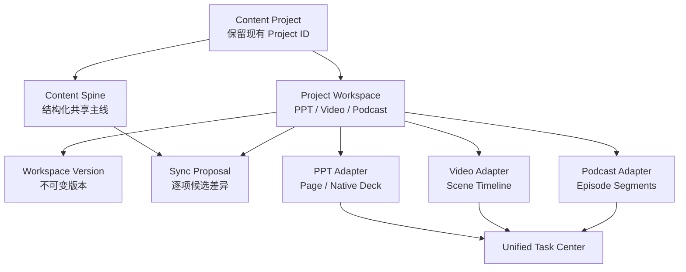

# EasySlide 统一内容项目与 PPT/视频/播客工作区实施计划

> 状态：已批准，实施中（CP6；CP0-CP5 已完成）  
> 日期：2026-07-26  
> 需求规格：`.omx/specs/deep-interview-content-project-workspaces.md`  
> UI 规范：`docs/UI_RULES.md`
> UI 视觉基线：`docs/superpowers/specs/2026-07-26-editorial-workbench-ui-baseline.md`

## 一、执行摘要

本计划把现有以 `Project -> Page` 为中心的 PPT 产品升级为统一内容项目：一个项目共享 Content Spine，并包含 PPT、视频、播客三个平级工作区。创建时选择首个工作区；其他工作区按需从已确认的 Content Spine 初始化。

实施不重建已经完成的视频旁白、版本、试听、快照和任务能力，而是把以下专项计划作为视频工作区内部依赖：

- `docs/superpowers/plans/2026-07-25-video-narration-animation-upgrade.md`
- `docs/superpowers/plans/2026-07-26-video-skills-toolkit-fusion-plan.md`

核心变更集中在四件事：

1. 建立 Content Spine、工作区、工作区版本和同步候选四个共享对象。
2. 建立统一项目壳层、四个一级入口和三模式创建流程。
3. 将现有 PPT、视频能力接入工作区协议，并新增完整播客工作区。
4. 通过带自动备份、离线校验和整体回滚的一次性迁移完成模型切换。

## 二、规划原则

1. **一个项目，一个共享主线，三个独立成稿。**
2. **任何跨工作区变更都先成为候选，不自动覆盖。**
3. **复用现有任务、旁白、TTS、视频和导出链路，不引入第二套运行时。**
4. **一次性迁移可以激进，但数据保护和可验证回滚不能简化。**
5. **首发只做一个当前成品与版本历史，不提前建设通用文档平台或统一素材库。**

### 决策驱动因素

- 现有 `Project` 已承载 PPT 模式、旁白偏好、任务、素材和页面，强行新建三类项目会复制大量链路。
- 视频旁白工作包 N1-N6 已完成，Hyperframes/Scene/Audio Mix/Proof 尚有清晰的剩余门禁。
- 用户允许数据库不可向下兼容，因此可以结束长期双轨，而不是让所有后续功能背负旧模型。

## 三、当前基线

### 3.1 数据与 API

- `backend/models/project.py:81` 的 `Project` 同时保存内容输入、PPT `render_mode`、原生主题、旁白偏好和导出设置。
- `backend/models/project.py:117` 直接关联 `Page`、`Task` 和 `Material`，没有工作区或共享内容主线。
- `backend/controllers/project_controller.py:614` 的创建接口只接受 PPT 创建语义；`render_mode` 仅允许 `image|native`。
- `backend/controllers/project_controller.py:761` 禁止项目创建后修改 `render_mode`，可以直接迁移为 PPT 工作区专属约束。
- `backend/config.py:22` 默认使用本地 SQLite；`backend/app.py:161` 仍通过 `db.create_all()` 和桌面 schema helper 补列。

### 3.2 前端与路由

- `frontend/src/App.tsx:67` 与 `frontend/src/App.tsx:89` 分别维护桌面和浏览器路由，项目阶段仍为 `/outline`、`/detail`、`/preview`。
- `frontend/src/pages/Home.tsx:321` 先选 PPT 内容来源，再在 `frontend/src/pages/Home.tsx:873` 选择图片或原生模式。
- `frontend/src/pages/Home.tsx:784` 调用 PPT 专属 `initializeProject`，随后跳转到旧阶段路由。
- `frontend/src/store/useProjectStore.ts:108` 的全局 store 混合项目加载、PPT 页面编辑、图片任务和导出，不适合继续承载 Content Spine、视频和播客全部状态。
- `frontend/src/types/index.ts:381` 的 `Project` 类型固定包含 `pages` 与 PPT/旁白字段。

### 3.3 已有可复用能力

- 现有 `WorkspaceShell`、任务中心、共享按钮/分段控件/Modal、参考文件、图片素材中心继续复用。
- 视频旁白版本、AI candidate、锁定、试听、Edge/Fish、不可变导出快照已经完成，不重建。
- 现有 `Material` 能管理图片；音频只补最小媒体类型和授权字段，首发不建设统一多媒体素材库页面。

## 四、架构决策

### 4.1 采用方案

保留现有项目 ID，把 `Project` 演进为内容项目根；新增四个共享模型，以工作区适配器连接不同成稿：



### 4.2 被否决的方案

1. **PPT、视频、播客三种项目类型：** 会复制研究资料、任务、素材、历史和设置，不符合用户确认的平级工作区关系。
2. **在旧 Project 上继续堆可空字段：** 初始改动小，但视频与播客会继续被 `Page/render_mode` 语义绑架，且无法干净表达同步与版本。
3. **一个通用 JSON Artifact 表承载所有内容：** 看似统一，但 PPT 页面、视频场景和播客片段的编辑/导出约束不同，首发会形成过早抽象。
4. **新旧模型长期双写：** 降低单次迁移压力，但长期一致性成本最高；用户已允许一次性不向下兼容迁移。

## 五、目标数据模型

### 5.1 Project 根对象

修改 `backend/models/project.py`：

- 保留 `id`、标题、创建时间、更新时间、任务、素材和参考文件关系。
- 新增 `schema_version`、`last_workspace`、`migration_state`、`project_settings_json`。
- 将 `render_mode`、主题、图片生成配置迁入 PPT 工作区设置。
- 将共享语言、品牌/语气、发音词典和默认声音约束迁入 `project_settings_json`；Content Spine 只保存内容语义，不混入供应商或导出设置。
- 将现有 PPT 阶段 `status` 迁入 PPT workspace；Project 根状态缩减为 `active|archived|migration_failed`，聚合进度从三个 workspace 与活动任务计算。
- 新代码切换后不再读写旧模式字段；清理迁移在发布前独立执行，避免边迁移边删源数据。

### 5.2 ContentSpine

新增 `backend/models/content_spine.py`：

- `id`, `project_id`（唯一外键）
- `revision`, `confirmed_revision`, `status`
- `document_json`, `content_hash`
- `created_at`, `updated_at`

新增 `shared/content/content-spine.schema.json`，固定主题、受众、目标、资料引用、研究、观点、事实、章节和叙事字段。后端写入前统一校验，禁止控制器内临时拼 JSON。

### 5.3 ProjectWorkspace

新增 `backend/models/project_workspace.py`：

- `id`, `project_id`, `kind=ppt|video|podcast`
- `state=uninitialized|draft|ready|stale`
- `revision`, `current_version_id`
- `source_kind=spine|ppt|migration|manual`
- `source_revision`, `source_ref`
- `settings_json`, `document_json`
- 唯一约束 `(project_id, kind)`

PPT 的 `document_json` 只保存轻量 manifest 和页面引用，不复制完整 Page 内容。视频和播客首发以 schema 校验的 JSON 文档保存场景/片段，避免在尚无第二个查询需求前拆出十余张细粒度表。

新增：

- `shared/content/video-workspace.schema.json`
- `shared/content/podcast-workspace.schema.json`

### 5.4 WorkspaceVersion

新增 `backend/models/workspace_version.py`：

- 不可变保存 `workspace_id`, `revision`, `document_json`, `settings_json`, `content_hash`。
- 保存 `source_type=manual|ai|sync|migration|restore`、父版本和创建时间。
- PPT 版本保存页面/图片/旁白版本引用 manifest，不复制媒体文件。
- 唯一约束 `(workspace_id, revision)`；恢复历史创建新版本，不移动 current 指针伪装新修改。

现有 `NarrationVersion` 保持 Page 专属，不增加 `owner_kind/owner_id` 一类多态外键。视频与播客的文案版本由 `WorkspaceVersion` 保存；只复用 `narration_service` 中无 Page 依赖的 segment、speaker、voice、diff 和缓存语义。PPT 转视频时可记录源 `NarrationVersion` ID，但转换后的修改独立版本化。

### 5.5 ContentSyncProposal

新增 `backend/models/content_sync_proposal.py`：

- `project_id`, `source_kind`, `target_kind`
- `source_revision`, `target_base_revision`
- `diff_json`, `status=pending|partially_applied|applied|rejected|stale`
- `created_at`, `resolved_at`

差异条目必须有稳定 `item_id`、路径、操作、before/after 和事实/结构类型。应用时同时校验源与目标修订；任一变化即返回 `409 STALE_SYNC_PROPOSAL`。

### 5.6 素材最小扩展

修改 `backend/models/material.py`，只增加工作区实际需要的字段：

- `media_kind=image|audio`
- `purpose=image|cover|bgm|sfx|voice_sample`
- `mime_type`, `duration_ms`
- `source_note`, `license_status`

现有图片默认迁移为 `media_kind=image`。不新增全局标签、全文检索、文件夹或统一素材库路由。

同时修改 `backend/controllers/material_controller.py` 与 `backend/services/file_service.py` 支持按 media kind 安全上传、读取和引用检查；现有 `MaterialCenterModal` 固定只请求/展示 image，避免把音频当作损坏缩略图。视频与播客在各自检查器中读取 audio。

## 六、服务与 API

### 6.1 服务边界

新增：

- `backend/services/content_spine_service.py`：校验、修订、确认、候选生成。
- `backend/services/project_workspace_service.py`：工作区创建、乐观并发、版本和恢复。
- `backend/services/content_sync_service.py`：结构化 diff、stale 检查和选择性应用。
- `backend/services/content_project_migration.py`：备份、转换、校验、恢复。
- `backend/services/podcast_service.py`：脚本/片段、角色、试听输入和候选。
- `backend/services/podcast_export_service.py`：不可变快照、混音、MP3/WAV、逐字稿和封面清单。

修改：

- `backend/services/task_manager.py`：增加 `CREATE_CONTENT_PROJECT`、`INITIALIZE_WORKSPACE`、`APPLY_SYNC_PROPOSAL`、`EXPORT_PODCAST`，复用现有暂停/恢复框架。
- `backend/services/narration_service.py`：只抽取视频与播客都需要的 segment/speaker/voice 纯语义 helper，不让播客依赖 Page。
- `backend/services/audio_mix_service.py`：由视频融合计划 VF3 建立，视频和播客共同消费。

### 6.2 项目与工作区 API

修改 `backend/controllers/project_controller.py`：

- `POST /api/projects` 接受 `initial_workspace` 与该模式的 `workspace_options`。
- 返回项目 ID、Content Spine 摘要、三个工作区状态和初始化任务 ID。
- `GET /api/projects/:id` 返回项目根、Spine 摘要与工作区摘要；PPT 页面只在 PPT 端点按需读取。

新增 `backend/controllers/content_workspace_controller.py`：

- `GET|PUT /api/projects/:id/content-spine`
- `POST /api/projects/:id/content-spine/confirm`
- `GET /api/projects/:id/workspaces`
- `GET|PUT /api/projects/:id/workspaces/:kind`
- `POST /api/projects/:id/workspaces/:kind/initialize`
- `GET /api/projects/:id/workspaces/:kind/versions`
- `POST /api/projects/:id/workspaces/:kind/versions/:version/restore`
- `POST /api/projects/:id/sync-proposals`
- `POST /api/projects/:id/sync-proposals/:proposal/apply`
- `POST /api/projects/:id/sync-proposals/:proposal/reject`

所有修改接口必须接受 `base_revision`，冲突统一返回 409 与当前修订摘要。

### 6.3 视频与播客 API

- 现有 narration、video export、snapshot API 保持单一实现，增加 `workspace_id`/场景来源适配，不复制控制器。
- 新增 `backend/controllers/podcast_controller.py`：脚本候选、应用、试听、导出预检与导出任务。
- Podcast 试听复用现有 TTS provider 和缓存；Fish 多人继续整集/章节编译，不伪造精确逐词 timing。
- MP3/WAV 和逐字稿由同一快照导出；封面作为快照引用，不在导出时重新生成。

## 七、前端产品结构

### 7.1 路由

重构 `frontend/src/App.tsx`，用一个 `AppRoutes` 定义同时服务 HashRouter 与 BrowserRouter，新增：

- `/project/:projectId/spine`
- `/project/:projectId/ppt/outline`
- `/project/:projectId/ppt/detail`
- `/project/:projectId/ppt/editor`
- `/project/:projectId/video`
- `/project/:projectId/podcast`

旧 `/outline`、`/detail`、`/preview` 使用 `LegacyProjectRedirect` 保留项目 ID 和查询参数，跳转对应 PPT 路由。

### 7.2 状态边界

新增 `frontend/src/store/useContentProjectStore.ts`，只保存：

- 项目根与三个工作区摘要；
- Content Spine 摘要和确认状态；
- 当前一级工作区与待处理同步数量；
- 项目加载/错误状态。

现有 `useProjectStore` 暂作为 PPT adapter，删除项目根加载的重复职责后再逐步缩小。视频和播客编辑状态默认组件局部化，只有跨路由恢复或性能证据出现时才新增专属 store。

### 7.3 统一壳层

新增：

- `frontend/src/components/content-project/ContentProjectLayout.tsx`
- `frontend/src/components/content-project/ContentWorkspaceNav.tsx`
- `frontend/src/components/content-project/WorkspaceEmptyState.tsx`
- `frontend/src/components/content-project/SyncReviewSheet.tsx`

复用 `WorkspaceShell`、任务中心和 UI 语义变量。一级导航固定显示内容主线、PPT、视频、播客；未初始化状态不伪装为禁用标签，而是进入可操作空状态。

全应用只保留一条 `216px` 左侧工具架。首页/创建/设置显示应用导航；进入项目后，同一外壳承载返回入口、四个工作区与当前页面/场景/片段索引。ContentProjectLayout 不得在现有 WorkspaceShell 左侧再叠一条完整导航；左栏不参与 Anime.js 路由动画。

### 7.4 首页作品墙

修改 `frontend/src/pages/History.tsx` 与 `frontend/src/components/history/ProjectCard.tsx`：

- 首页采用紧凑品牌/快速创建条、四列内容项目作品墙和后置灵感墙，不使用营销 Hero 或统计卡片墙抢占第一视口。
- 项目封面按最近已初始化工作区选择 PPT 首屏、视频关键帧或播客封面；没有可用封面时使用确定性占位。
- 卡片只常驻标题、更新时间和聚合状态；工作区可用性用紧凑图标/标签表达。
- 编辑、导出、删除在 Hover、`focus-within`、选中或批量模式显示；无 Hover 环境常驻“更多”图标。
- `>=1280px` 固定四列、封面 `16:9`，操作覆盖层不得改变卡片尺寸。

### 7.5 创建页

修改 `frontend/src/pages/Home.tsx`：

1. 第一层分段控件选择 PPT、视频、播客。
2. 第二层按模式显示创建来源与必需选项。
3. PPT 内保留图片/原生创建方式。
4. 提交后先获得项目与任务 ID，立即进入所选工作区的生成状态。
5. 参考资料对三种模式复用；图片模板、视频 preset、播客角色不互相显示。

### 7.6 工作区页面

- `ContentSpineWorkspace`：字段编辑、确认状态、来源、同步候选入口。
- `PptWorkspaceAdapter`：承接现有 Outline/Detail/SlidePreview/NativeDeck，不首轮重写编辑器。
- `VideoWorkspace`：左侧场景列表、中间预览、右侧场景/旁白/字幕/动效属性，统一两个来源入口。
- `PodcastWorkspace`：左侧片段/章节、中间脚本与播放器、右侧角色/声音/BGM/SFX/封面属性。

UI 必须遵守 `docs/UI_RULES.md` 的“不可破坏的产品原则”“空间结构”“动效”“页面规则”和“性能规则”。

## 八、激进迁移设计

### 8.1 迁移机制

新增迁移版本和 `content_project_migration` 服务，桌面 SQLite 采用离线副本切换：

1. 应用启动时在打开业务连接前检查 schema version。
2. 使用 Python `sqlite3.Connection.backup()` 创建带时间戳备份并计算 SHA-256。
3. 进入维护状态并拒绝业务写入，在临时数据库副本执行 schema 与数据迁移，不直接修改原库。
4. 运行结构、计数、外键、文件引用、内容哈希和抽样语义校验。
5. 校验通过后关闭连接，以原子重命名切换数据库；保留原备份。
6. 任一步失败则删除临时副本、继续使用原库并显示阻塞式升级报告。

迁移不搬动物理素材文件，只重建数据库关联。非 SQLite 的 `DATABASE_URL` 只允许显式 Alembic 升级，要求部署方先完成外部备份。

### 8.2 旧数据映射

- 每个旧 Project 创建三条 workspace：PPT=`ready/draft`，视频/播客=`uninitialized`。
- `render_mode/native_theme/native_image_settings` 进入 PPT settings。
- Page、PageImageVersion、NarrationVersion 保持原 ID，补 PPT workspace 关联或由 manifest 引用。
- `idea_prompt/outline_text/description_text`、参考文件解析内容和要求字段生成基础 Content Spine。
- Content Spine 迁移只做确定性字段映射和结构化解析，禁止调用外部 AI；无法归纳的研究内容保留原文引用并标记待确认。
- 旧旁白/视频导出记录继续归属于 PPT 来源的视频能力；只有用户首次进入视频工作区时才生成场景时间线候选。
- 现有 Material 默认设为 image；不移动文件。

### 8.3 校验与清理

迁移必须输出 JSON 报告：

- 迁移前后项目、页面、图片版本、旁白版本、任务、素材、参考文件数量；
- 每个项目三个工作区唯一性；
- 所有当前版本、文件和外键引用；
- Content Spine 生成状态和待确认字段；
- 失败项目及可操作原因。

只有真实数据库副本与基准库都通过后，才执行独立清理 revision，删除不再使用的旧模式字段和旧内部 API。清理前后再次运行同一报告。

## 九、实施工作包

每个工作包必须独立可验证；前一门禁未通过，不得让后续包掩盖失败。

### CP0：契约、基线与测试夹具

**目标：** 在改模型前冻结行为和性能基线。

修改/新增：

- `.omx/specs/deep-interview-content-project-workspaces.md`
- `shared/content/*.schema.json`
- `backend/tests/fixtures/legacy_content_projects.py`
- `backend/tests/unit/test_content_workspace_schemas.py`
- `frontend/src/tests/components/Home.content-mode.test.tsx`
- `frontend/src/tests/components/App.content-routes.test.tsx`

步骤：

1. 建立空白、图片 PPT、原生 PPT、翻新 PPT、带旁白/素材/参考文件/活动任务的旧库夹具。
2. 记录 20 页项目读取、打开和路由切换基线。
3. 为 Content Spine、视频场景、播客片段和同步 diff schema 写拒绝非法数据的测试。
4. 冻结当前旧路由和旧项目打开行为测试。

**出口门禁：** 夹具可重复生成；基线报告入库；schema 测试和旧行为测试通过。

### CP1：共享模型与可回滚迁移骨架

**目标：** 新模型可创建、可升级、可恢复，尚不切换 UI。

修改/新增：

- `backend/models/project.py`
- `backend/models/content_spine.py`
- `backend/models/project_workspace.py`
- `backend/models/workspace_version.py`
- `backend/models/content_sync_proposal.py`
- `backend/models/material.py`
- `backend/models/__init__.py`
- `backend/migrations/versions/<next>_add_content_workspaces.py`
- `backend/services/content_project_migration.py`
- `backend/tests/unit/test_content_project_migration.py`

步骤：

1. 先写迁移失败、重复工作区、引用缺失和恢复备份测试。
2. 创建新表、索引、唯一约束和媒体最小字段。
3. 用同一迁移函数服务 Alembic revision 与桌面离线迁移，避免两份数据映射逻辑。
4. 在临时数据库执行迁移、校验和原子切换。
5. 保留旧字段只作为未切换阶段的迁移源，不开始双写。

**出口门禁：** 所有旧库夹具升级成功；故障注入能恢复原库；重复运行幂等；源库与备份分别记录文件 SHA-256，且完整 schema+数据的逻辑 SHA-256 一致。SQLite 原生 `backup()` 会更新文件头，禁止错误地要求两个物理文件哈希相等。

### CP2：Content Spine 与工作区核心服务

**目标：** 新项目可创建 Content Spine 与三条工作区记录，未选工作区不生成。

修改/新增：

- `backend/services/content_spine_service.py`
- `backend/services/project_workspace_service.py`
- `backend/controllers/content_workspace_controller.py`
- `backend/controllers/project_controller.py`
- `backend/controllers/__init__.py`
- `backend/app.py`
- `backend/services/task_manager.py`
- `backend/tests/unit/test_content_spine_service.py`
- `backend/tests/unit/test_content_workspace_api.py`
- `backend/tests/unit/test_content_project_creation_task.py`

步骤：

1. 先测试同事务创建 Project、Spine 和三条唯一 workspace。
2. 实现 Spine schema 校验、修订、确认和内容哈希。
3. 扩展创建 API，以一个可恢复任务完成“资料归一化 -> Spine -> 首个工作区草稿”；这是一次用户操作，但内部按依赖顺序执行，工作区不得绕过 Spine 读取原始输入另生成一套主线。
4. 实现 workspace 初始化门禁：Spine 未确认返回可操作错误，不启动生成任务。
5. 把失败、暂停、恢复和阶段进度接入现有 Task，不另建任务引擎。

**出口门禁：** 三种创建入口的 API 集成测试通过；未选工作区模型/TTS/图片调用计数为 0；恢复任务继续使用冻结输入。

### CP3：统一项目壳层与创建入口

**目标：** 用户可以创建任一模式并在四个一级入口间切换。

修改/新增：

- `frontend/src/App.tsx`
- `frontend/src/pages/Home.tsx`
- `frontend/src/pages/History.tsx`
- `frontend/src/components/history/ProjectCard.tsx`
- `frontend/src/components/shared/AppTopNav.tsx`
- `frontend/src/types/index.ts`
- `frontend/src/api/endpoints.ts`
- `frontend/src/store/useContentProjectStore.ts`
- `frontend/src/components/content-project/*`
- `frontend/src/tests/components/App.content-routes.test.tsx`
- `frontend/src/tests/components/Home.content-mode.test.tsx`
- `frontend/src/tests/components/ContentProjectLayout.test.tsx`
- `frontend/e2e/editorial-workbench-home.spec.ts`

步骤：

1. 先写四入口、旧路由跳转、刷新恢复和未初始化空状态测试。
2. 合并 HashRouter/BrowserRouter 的重复路由定义。
3. 将全局/项目导航收敛为单一静止 `216px` 工具架，右侧路由内容才允许 Anime.js 短过渡。
4. 建立只承载项目摘要的 content project store，并提供最近工作区封面选择信息。
5. 将项目中心改为四列内容项目作品墙；补齐 Hover/Focus/无 Hover 操作入口和三种封面来源。
6. 将 Home 改为模式优先创建，PPT 的图片/原生作为二级设置。
7. 接入统一任务状态；生成中可切到 Spine，但不允许重复提交。

**出口门禁：** 三模式创建组件测试通过；旧 URL 保留 query/hash；三个规定视口与 100%/125% 截图无重叠；1280px 首页保持四列且第一视口以作品为主；左栏切换像素稳定；卡片操作在鼠标、键盘和无 Hover 环境均可用。

**2026-07-26 实施证据：** 前端聚焦 42 项、后端工作区 API 8 项、Chromium 三视口及 125% 缩放 8 项全部通过，`build:check` 与定向 `git diff --check` 通过。PPT 编辑器内部页索引与项目工具架的最终合并随 CP5 的 `PptWorkspaceAdapter` 收口，不在 CP3 重写既有编辑器。

### CP4：版本与受控双向同步

**目标：** 所有跨工作区变更均可审查、可冲突、可追溯。

修改/新增：

- `backend/services/content_sync_service.py`
- `backend/services/project_workspace_service.py`
- `backend/controllers/content_workspace_controller.py`
- `frontend/src/components/content-project/SyncReviewSheet.tsx`
- `frontend/src/components/content-project/WorkspaceVersionHistory.tsx`
- `backend/tests/unit/test_content_sync_service.py`
- `backend/tests/unit/test_workspace_versions.py`
- `frontend/src/tests/components/SyncReviewSheet.test.tsx`

步骤：

1. 为 Spine 字段、PPT 页面引用、视频场景和播客片段建立稳定 diff item。
2. 实现 candidate 创建、逐项应用、拒绝、部分应用和 stale 409。
3. 应用候选时创建新 workspace/spine revision 与审计版本。
4. UI 展示 before/after、来源、影响范围和逐项选择；不提供无审查整区覆盖。
5. 为三个工作区提供统一版本历史入口；恢复旧版永远创建新 revision。
6. 增加并发修改、重复应用和目标删除测试。

**出口门禁：** 参数化测试证明未选差异不改变；AI/sync 路径零自动覆盖；过期 proposal 无法应用；三个工作区均能恢复历史并保留审计链。

**2026-07-26 实施证据：** CP0-CP4 后端合并聚焦 54 项通过；CP4 schema/service/API 27 项、前端审查/历史/路由 6 项通过；`build:check`、致命 Flake8 和定向 diff 检查通过。100 项目/2000 页迁移为 `336.359ms`，低于 `394.303ms` 上限。

### CP5：PPT 工作区适配与旧路由收编

**目标：** 在不重写现有编辑器的前提下，把 PPT 全链路纳入统一项目壳层。

修改：

- `frontend/src/pages/OutlineEditor.tsx`
- `frontend/src/pages/DetailEditor.tsx`
- `frontend/src/pages/SlidePreview.tsx`
- `frontend/src/components/native-deck/NativeDeckWorkspace.tsx`
- `frontend/src/store/useProjectStore.ts`
- `backend/controllers/page_controller.py`
- `backend/controllers/native_deck_controller.py`
- `backend/controllers/export_controller.py`

步骤：

1. 增加 PPT workspace adapter，继续复用 Page 与 Native Deck。
2. 将 `render_mode` 和 PPT 设置改从 workspace settings 读取。
3. 保存页面/生成图片/导出时提升 PPT workspace revision，并生成轻量版本 manifest。
4. 从 PPT 提出 Content Spine 候选时只提取结构化观点/事实/章节，不上传视觉样式噪声。
5. 保持旧项目 ID、页面 ID、图片版本和导出结果可读。

**出口门禁：** 当前 PPT 全量聚焦测试无回归；图片/原生/翻新三条 E2E 通过；旧路由与新路由打开同一内容。

**2026-07-26 实施证据：** PPT workspace settings 已成为图片/原生模式、主题、图片设置和画幅读取源；页面、原生生成、图片生成/编辑、翻新、描述和导出均提升不可变 revision，并保存轻量页面/图片/旁白引用 manifest。PPT→Spine 仅生成标题、观点和摘要候选，不携带布局、模板或图片样式。后端聚焦 48 项、前端编辑器/壳层 74 项、兼容路由 11 项通过；图片/原生/翻新在 1280×720、1440×900、1920×1080 下 9 项 Chromium E2E 通过。项目内 `WorkspaceShell` 页面栏与大纲页面索引统一挂入既有 216px 工具架，不再挤出第二条侧栏；前端生产构建、致命 Flake8 和定向 diff 检查通过。

### CP6：视频工作区与现有视频计划融合

**目标：** 两个创建来源进入统一场景时间线，并完成正式发布所需视频门禁。

修改/新增：

- `frontend/src/components/video/VideoWorkspace.tsx`
- `frontend/src/components/video/VideoSceneRail.tsx`
- `frontend/src/components/video/VideoSceneInspector.tsx`
- 复用 `frontend/src/components/narration/*`
- `backend/services/video_workspace_adapter.py`
- `backend/controllers/material_controller.py`
- `backend/services/file_service.py`
- `frontend/src/components/shared/MaterialCenterModal.tsx`（继续只展示图片）
- 关联两份视频计划列出的 M0、M2、VF1-VF6 文件

步骤：

1. 将 Content Spine 章节映射为独立视频场景；将 PPT 页面映射为带 page source ref 的场景。
2. 两种来源写入同一 video workspace schema 和版本服务。
3. 将 NarrationWorkbench 的纯编辑部件适配到 scene；版本、锁定和 AI candidate 写入 WorkspaceVersion，TTS/voice/cache 继续复用现有服务，不让新 scene 伪装成 Page。
4. 关闭 M0 的主动失败自动接管、真实音视频、生产依赖漏洞门禁。
5. 完成 audio material 的安全上传、授权字段、引用检查与工作区内选择；图片素材中心显式过滤 audio。
6. 完成 M2 Scene Bundle/真实 TTS/生产渲染、VF3 Audio Mix、VF4 Proof、VF5 Article Pack 和 VF6 发布观测。
7. 保持 Hyperframes + browser fallback + FFmpeg 单一生产链路，不引入 Remotion。
8. 同步完成视频工作区的编辑部工作桌视觉门禁：单一静止工具架、场景栏/播放器/属性栏三栏稳定、全交互状态与 reduced motion；在三个规定视口和 Windows 125% 缩放下截图验收。

**出口门禁：** 独立视频与 PPT 讲解视频生成相同 schema；Core/Article 两条桌面 Proof -> Final 成功；fallback 故障注入、FFprobe、关键帧和人工听检通过；视频工作区通过 `docs/UI_RULES.md` 的三视口、键盘、无 Hover 和 reduced-motion 门禁。

### CP7：播客工作区

**目标：** 完成音频节目的编辑、试听、混音和导出闭环。

修改/新增：

- `backend/services/podcast_service.py`
- `backend/services/podcast_export_service.py`
- `backend/controllers/podcast_controller.py`
- `frontend/src/components/podcast/PodcastWorkspace.tsx`
- `frontend/src/components/podcast/PodcastSegmentRail.tsx`
- `frontend/src/components/podcast/PodcastEditor.tsx`
- `frontend/src/components/podcast/PodcastInspector.tsx`
- `backend/tests/unit/test_podcast_service.py`
- `backend/tests/unit/test_podcast_export.py`
- `frontend/src/tests/podcast/*.test.tsx`
- `frontend/e2e/podcast-single-export.spec.ts`
- `frontend/e2e/podcast-dialogue-export.spec.ts`

步骤：

1. 先为单人、2-4 人、锁定片段、候选应用和 revision 冲突写服务测试。
2. 复用 narration 的 speaker/segment/voice 规范，但用 adapter 消除 Page 外键假设。
3. 实现逐段与整集试听；Edge 按 segment 缓存，Fish 按节目编译 manifest 缓存。
4. 复用 Audio Mix Manifest，支持 BGM/SFX/ducking/淡入淡出和资产引用预检。
5. 从同一不可变快照导出 MP3/WAV、逐字稿和封面清单；暂停恢复不重新 TTS。
6. UI 采用片段栏、脚本/播放器、属性栏三栏结构，长节目虚拟化或按需挂载。
7. 同步完成播客工作区的编辑部工作桌视觉门禁；BGM、SFX、声音与封面素材只在工作区内管理，不扩建全局多媒体素材库。

MP3 使用 FFmpeg 写入标题、作者、章节和封面元数据；WAV 与逐字稿、封面图片作为同一导出包的并列文件，不承诺播放器都能显示 WAV 内嵌封面。

**出口门禁：** 单人和多人两条桌面真实导出通过；音频无削波、时长/逐字稿一致；删除被引用 BGM 时预检失败且不生成损坏文件；播客工作区通过 `docs/UI_RULES.md` 的三视口、键盘、无 Hover 和 reduced-motion 门禁。

### CP8：正式切换与旧结构清理

**目标：** 在真实副本验证后结束旧模型读写，不保留双轨。

修改/新增：

- `backend/app.py`
- `backend/migrations/versions/<next>_remove_legacy_project_mode_fields.py`
- `desktop/main.js`（仅升级维护状态与失败报告需要）
- `backend/tests/integration/test_content_project_cutover.py`
- `scripts/verify-content-project-migration.ps1`

步骤：

1. 在用户数据库只读副本运行迁移、校验、打开/导出冒烟，不触碰原库。
2. 全代码搜索旧字段/API 调用，切换为 workspace/spine 服务。
3. 删除旧内部端点或改为明确跳转/委托，不保留双写。
4. 执行旧字段清理 revision，再跑全套迁移校验。
5. 实际演练升级失败恢复和恢复备份降级。

**出口门禁：** 新业务代码无旧字段读写；真实副本迁移零孤儿引用；失败演练恢复原库；旧版本只能通过备份降级的限制有明确提示。

### CP9：集成、发布与文档

**目标：** 三模式同版本正式开放，并完成已随 CP3-CP8 推进的 UI 一致性收尾。

修改/新增：

- `frontend/e2e/content-project-create-modes.spec.ts`
- `frontend/e2e/content-project-sync.spec.ts`
- `frontend/e2e/legacy-project-migration.spec.ts`
- `docs/zh/features/content-projects.mdx`
- `docs/features/content-projects.mdx`
- `docs/docs.json`
- 发布与桌面打包脚本

步骤：

1. 运行单元、集成、E2E、视觉、迁移、真实音视频和桌面包矩阵。
2. 检查四入口、空状态、同步、版本、任务恢复和质量报告。
3. 所有内部 feature flags 默认关闭完成灰度验证；正式发布配置一次性开启三工作区。
4. 更新用户文档、备份/降级说明和已知限制。
5. 对照编辑部工作桌 10 轮基线做最终跨页面审计；只修一致性、溢出、无障碍和动效清理问题，不在此阶段重做信息架构。

**出口门禁：** 三模式创建与导出全链路通过；无阻塞迁移问题；所有正式 flags 同时开启；发布检查表签字完成。

## 十、功能开关

仅用于开发与验收，不作为正式残缺发布手段：

- `content_project_shell`
- `content_spine`
- `video_workspace`
- `podcast_workspace`
- `content_sync_review`
- `content_project_cutover`

依赖顺序：`content_project_shell -> content_spine -> sync/workspaces -> cutover`。正式版本缺少任一核心开关都视为构建配置错误。

## 十一、验证计划

### 11.1 聚焦验证

```powershell
uv run pytest backend/tests/unit/test_content_workspace_schemas.py backend/tests/unit/test_content_project_migration.py -q
uv run pytest backend/tests/unit/test_content_spine_service.py backend/tests/unit/test_content_workspace_api.py backend/tests/unit/test_content_sync_service.py -q
uv run pytest backend/tests/unit/test_podcast_service.py backend/tests/unit/test_podcast_export.py -q

cd frontend
npm test -- --run src/tests/components/Home.content-mode.test.tsx src/tests/components/App.content-routes.test.tsx
npm test -- --run src/tests/components/ContentProjectLayout.test.tsx src/tests/components/SyncReviewSheet.test.tsx
npm test -- --run src/tests/podcast
```

### 11.2 视频专项门禁

执行关联视频计划中的全部 M0/M2/VF 发布命令，至少包含：

```powershell
uv run pytest backend/tests/unit/test_hyperframes_renderer.py backend/tests/unit/test_video_visual_renderer.py -q
uv run pytest backend/tests/unit/test_video_export_snapshot.py backend/tests/unit/test_video_audio_timeline.py backend/tests/unit/test_motion_manifest.py -q
```

并完成 Core/Article 的桌面 Proof -> Final、主动失败 fallback、FFprobe、关键帧和人工听检。

### 11.3 全量门禁

```powershell
uv run pytest backend/tests/unit -q
cd frontend
npm test
npm run build:check
npx playwright test
cd ..
npm run build:desktop
```

桌面产物必须实际启动并验证：

- 新建 PPT、视频、播客各一个项目；
- 在同一项目初始化另外两个工作区；
- 双向创建并逐项应用同步候选；
- 旧数据库升级与恢复备份；
- PPT/PDF、MP4、MP3/WAV 真实导出；
- 暂停应用后恢复活动任务。

### 11.4 视觉与性能

- Playwright 截图覆盖 1280x720、1440x900、1920x1080 与 Windows 100%/125%。
- 检查单一 `216px` 工具架、四列内容项目作品墙、场景/片段索引、画布/播放器、属性栏和任务中心无重叠。
- 检查 PPT/视频/播客封面、最长标题、空封面、批量选择，以及 Hover/Focus/无 Hover 操作显隐。
- 验证 Anime.js 只作用于右侧路由工作区；左栏不重挂载，reduced motion 取消位移且动画清理无残留。
- 记录交互反馈、面板打开、项目读取 p95 和迁移基准；不得超过规格阈值。
- 20 页、20 场景和长播客数据集检查局部渲染，不允许输入一次重渲染整个工作区。

## 十二、可观测性

首发只写任务质量报告和本地结构化日志，不建设遥测平台。记录：

- 项目/Spine/workspace/schema revision；
- 初始化来源、生成阶段和模型调用计数；
- sync proposal 的源/目标 revision、选择项数和 stale 原因；
- 视频 scene/motion/audio/snapshot hash 与 fallback；
- 播客 script/audio mix/export hash、TTS cache 和音频峰值；
- 迁移备份路径、hash、计数校验、耗时和恢复结果。

日志不得包含 API Key、完整私有声音样本或用户全文内容。

## 十三、预演失败场景

### 场景 1：迁移成功启动，但部分旧导出/旁白引用丢失

- 原因：只校验项目和页面计数，没有遍历间接引用。
- 预防：CP0 建立复杂旧库夹具；CP1/CP8 校验所有外键、文件存在、当前版本与任务 snapshot。
- 停止条件：任一孤儿引用阻止原子切换，继续使用原库。

### 场景 2：Content Spine 同步覆盖用户精修成稿

- 原因：proposal 应用时未重新检查目标 revision，或 UI 默认全选。
- 预防：数据库 revision + 409 stale；UI 默认不全选；参数化测试验证未选项不变。
- 停止条件：发现任一未经确认的覆盖路径，三模式正式发布全部阻断。

### 场景 3：三个入口上线，但视频或播客只是导出弹窗而非完整工作区

- 原因：复用旧能力时只换入口，没有完成独立主对象、版本和恢复。
- 预防：以 Video Workspace/Podcast Workspace E2E 和真实成品为门禁，不以组件存在为完成标准。
- 停止条件：任一模式无法从创建到可编辑成稿再到真实导出，正式版本不发布。

## 十四、风险与缓解

| 风险 | 缓解 |
|---|---|
| `ProjectWorkspace.document_json` 变成无边界大对象 | schema + revision + 体积指标；只有出现独立查询/更新瓶颈时再拆场景/片段表 |
| `useProjectStore` 继续膨胀 | 新建小型 content project store；旧 store 只作为 PPT adapter |
| 激进迁移无法原地回滚 | 在临时 SQLite 副本迁移并原子切换，原库和备份都不修改 |
| 视频专项计划与总计划写集冲突 | CP6 只增加 workspace adapter；M0/M2/VF 按原计划完成并以 schema 为边界 |
| 播客复制视频旁白逻辑 | 抽取无 Page 依赖的纯语义 helper，TTS/provider/audio mix 保持单一实现 |
| 素材库范围失控 | 只扩展 Material 的 audio 元数据，UI 留在工作区，不加全局搜索/标签/文件夹 |
| 三模式同发扩大回归面 | 分阶段 flags、每包出口门禁、最终全量与真实桌面产物验证 |

## 十五、ADR

### 决策

演进现有 Project ID 为内容项目根，新增 Content Spine、Project Workspace、Workspace Version 和 Sync Proposal；PPT 使用现有 Page adapter，视频和播客使用 schema 化工作区文档；通过备份后的离线副本迁移一次性切换。

### 为什么选择

- 保留用户项目、文件和历史引用的稳定标识。
- 共享能力只抽取一次，又不强迫三种成稿使用同一种内部编辑模型。
- 支持用户确认的双向候选同步、一个当前成品和激进迁移。
- 新增模型数量有限，且每个模型对应已确认的产品对象。

### 后果

- 新版本数据库不能由旧版本直接读取。
- 正式发布前必须完成真实数据库副本迁移和三模式全链路。
- 视频正式发布继续受现有 M0/M2/VF 门禁约束。
- 统一素材库、多成品和通用 Artifact 平台延期，未来必须由真实需求触发。

## 十六、实施权限与停止条件

实施者可在不改变规格的前提下调整内部命名、索引、文件拆分和测试位置。以下情况必须停止并重新让用户拍板：

- 需要新增或替换生产视频/TTS 运行时；
- 需要搬迁或删除用户媒体文件；
- 无法保持旧项目 ID 或无法完整恢复备份；
- 要把任一工作区从正式版本移除；
- 要允许自动同步覆盖、多个当前成品或外部平台发布；
- 性能或真实音视频门禁只能通过降低已确认质量标准解决。

## 十七、完成定义

- [ ] 需求规格中的所有验收标准有自动测试或明确人工验证证据。
- [ ] 三模式创建、编辑、版本、同步、暂停恢复和真实导出闭环完成。
- [ ] 旧数据库备份、迁移、校验、失败恢复和备份降级演练通过。
- [ ] 新业务代码不再读写旧项目模式字段，不存在长期双写。
- [ ] 视频关联计划全部发布门禁关闭。
- [ ] 播客单人/多人 MP3/WAV、逐字稿和封面链路通过。
- [ ] UI 规则、无障碍、视口、Windows 缩放和性能门禁通过。
- [ ] 桌面生产包完成 PPT、视频、播客真实冒烟。
- [ ] 正式构建同时开启 Content Spine、PPT、视频、播客。

本计划已由用户明确批准；按 CP0 到 CP9 的门禁顺序实施。UI 升级随各 CP 的功能同步通过门禁，CP9 只做全局一致性、真实产物和发布收尾。
