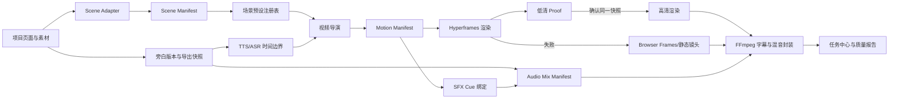

# EasySlide 视频创作能力融合升级计划

> **状态：** 已规划；VF0 可先行，生产接入受 Hyperframes M0 全部门禁约束  
> **日期：** 2026-07-26  
> **上位计划：** `docs/superpowers/plans/2026-07-25-video-narration-animation-upgrade.md`  
> **参考项目：** `liangdabiao/video-skills-toolkit`  
> **核心决策：** 借鉴其场景方法、音频工作流和资产治理，不引入 Remotion 生产运行时

## 一、目标与成功定义

本计划把 `video-skills-toolkit` 中对 EasySlide 有价值的能力，融合到现有
`Narration Snapshot -> Scene Manifest -> Motion Manifest -> Hyperframes -> FFmpeg`
链路中，形成可复用、可验证、可降级的视频创作层。

完成后，EasySlide 应具备：

1. 一套渲染器无关的语义场景预设，覆盖封面、列表、数据、对比、流程、原文图和收尾。
2. 一套与旁白和动画事件对齐的 SFX/BGM 混音协议。
3. 一个低清 Proof -> 用户确认 -> 高清成片的同快照工作流。
4. 首个垂直模板包“文章讲解”，后续可增加口播、数学证明等模板包。
5. 所有新增能力继续使用现有任务中心、不可变快照、质量报告和降级链路。

量化成功标准：

- 同一导出快照重复渲染的关键帧与 cue 时间一致。
- Proof 与正式导出使用相同内容、场景、旁白、音频 cue 和资源 hash。
- 新增场景预设不引入第二套 composition、帧时钟或浏览器运行时。
- BGM/SFX 关闭时，现有视频输出与当前基线保持兼容。
- 任一场景、音效或 Hyperframes 渲染失败时，可按策略降级并完成允许降级的任务。
- 所有第三方字体、音效和音乐均有可追溯授权记录，仓库和快照中无密钥。

## 二、范围冻结

### 2.1 首期纳入

- 语义场景预设：`cover`、`list`、`stat`、`compare`、`flow`、`article-image`、`quote`、`outro`。
- 动画组件意图：标题强调、列表逐项、数字计数、流程连线和原文图完整展示。
- SFX cue、用户 BGM、自动循环/裁切、淡入淡出和旁白 ducking。
- 低清 Proof 任务、确认后高清导出、同快照复用。
- “文章讲解”模板包，优先消费现有 Markdown/文档导入结果和项目素材。
- 场景、音频和 Proof 质量报告。

### 2.2 后续扩展

- 可选口播 PIP，包括上传口播视频、圆形/矩形画中画和录屏素材。
- 代码/终端高亮和逐字符输入场景。
- 数学证明模板包，包括公式推导、几何 SVG 和步骤式揭示。
- 用户上传音频/视频的通用转写与字幕导入。
- 纸片分层和手绘故事模板包。

### 2.3 明确不做

- 不复制或嵌入外部仓库的 Remotion/React 19 模板代码。
- 不在生产链路并存 Hyperframes、Remotion 和 Anime.js 时间线。
- 不引入 MediaKit + 公共 R2 上传作为字幕默认链路。
- 不依赖 IdeaFlow 等未受控第三方服务抓取公众号文章。
- 不建设自由时间轴、逐帧关键帧编辑器或多轨专业剪辑器。
- 不自动给每个动画添加音效；SFX 必须经过预设或用户显式启用。
- 不直接导入外部仓库中的 `.env.example`、密钥、绝对路径或未完成授权审计的素材。

## 三、融合原则

1. **内容和时间分权：** Narration Snapshot 是内容真相；TTS/ASR boundary 是时间真相；字幕不是内容主数据。
2. **语义先于实现：** 场景预设描述信息结构和动效意图，不保存 Hyperframes 或 GSAP 专属代码。
3. **单一生产时间线：** Motion Manifest 是唯一动画导演输出，Hyperframes 只负责执行。
4. **音频后置锁定：** 先冻结旁白和画面节奏，再锁定 SFX/BGM cue；修改触发精确失效。
5. **渐进增强：** 无场景能力时仍可用整页镜头；无 SFX/BGM 时仍可导出旁白视频。
6. **资产可追溯：** 每个内置资产必须记录来源、许可证、hash 和允许用途。
7. **Proof 不分叉：** Proof 只是质量参数不同，不允许重新生成文案、场景或声音。

## 四、目标架构



职责边界：

- **场景预设注册表**决定某类内容适合哪些语义元素、动效和 cue，不决定真实时间。
- **视频导演**将场景、旁白边界和预设转换为 Motion Manifest。
- **Audio Mix Manifest**冻结 BGM、SFX、音量、循环、淡入淡出和 ducking 策略。
- **Proof 服务**复用同一快照，仅覆盖分辨率、FPS、编码质量和输出类型。
- **FFmpeg**继续负责最终字幕、音频混合、响度处理和容器封装。

## 五、数据协议

### 5.1 Scene Preset

新增 `shared/video/scene-preset.schema.json`，描述渲染器无关的场景能力：

```json
{
  "schema_version": 1,
  "id": "article-image",
  "label": "原文图",
  "supported_page_kinds": ["content", "data"],
  "required_roles": ["headline", "visual"],
  "optional_roles": ["supporting"],
  "layout_rules": {
    "image_fit": "contain",
    "max_text_items": 3
  },
  "motion_recipe": {
    "headline": "fade_up",
    "visual": "scale_fade",
    "supporting": "fade"
  },
  "sfx_recipe": {
    "visual": "soft_pop"
  }
}
```

约束：

- Preset 只引用语义 role 和标准 effect ID，不保存 CSS、JSX 或 GSAP 代码。
- `article-image` 默认 `contain`，不得静默裁切带文字的原文图。
- 图源按现有 `body + supporting` 元素表达，不为单一模板增加 `source` role。
- 场景适配失败时回退 `generic-content`，不得阻塞导出。
- 首期不修改正在用于 M1 的 Scene Manifest v1；Preset 由服务映射到 v1 元素。
- 只有图片场景进入 P2 且 v1 无法表达时，才提出 Scene Manifest v2 ADR。

### 5.2 标准动效词表

首期 effect ID 固定为：

- `fade`、`fade_up`、`scale_fade`、`draw_line`
- `list_reveal`、`number_count`、`chart_reveal`
- `focus_pulse`、`camera_push`、`camera_pan`

每个 effect 必须声明：

- 支持的 element kind 和 motion capability。
- 默认时长、最短时长、最大重复次数。
- reduced-motion 预览策略。
- Hyperframes 实现与 browser-frame/static fallback。
- 可选 cue 事件名称，例如 `enter_start`、`enter_end`、`value_settled`。

### 5.3 时间绑定

Motion 事件优先绑定稳定 ID：

```json
{
  "element_id": "metric-growth",
  "effect": "number_count",
  "trigger_segment_id": "segment-uuid",
  "trigger_offset_ms": 120,
  "duration_ms": 720
}
```

规则：

- `word_exact/segment_exact/aligned` 可使用紧贴语义的 cue。
- `estimated` 只允许段落级宽松窗口和页面级镜头，不启用逐词或密集 SFX。
- 用户修改文字但 `segment_id` 不变时，时间边界重新计算；场景语义不必全部失效。
- 拆分/合并 segment 时，只失效引用受影响 segment 的 Motion/SFX cue。

### 5.4 Audio Mix Manifest

新增 `shared/video/audio-mix-manifest.schema.json`：

```json
{
  "schema_version": 1,
  "narration": {"source": "tts-manifest", "normalize": true},
  "music": {
    "asset_id": "user-bgm-uuid",
    "enabled": true,
    "loop": true,
    "fade_in_ms": 600,
    "fade_out_ms": 900,
    "duck_under_narration": true,
    "gain_db": -24
  },
  "sfx": [
    {
      "cue_id": "sfx-title-1",
      "asset_id": "soft-impact",
      "page_id": "page-uuid",
      "motion_event_id": "title.enter_end",
      "offset_ms": 0,
      "gain_db": -18
    }
  ]
}
```

约束：

- `asset_id` 解析到项目资产或已审计的内置资产，不直接接受任意系统路径。
- cue 必须绑定 page/segment/motion event 之一，不能只保存容易漂移的全局秒数。
- 删除被引用资产时预检失败或按显式策略禁用该轨，不静默换素材。
- 混音输出不得削波；输出时长与视频差值不超过 250ms。
- BGM 默认关闭；SFX 默认 `subtle`，用户可以一键关闭全部 SFX。

### 5.5 Proof Snapshot

不新增第二份内容快照。现有导出快照增加：

- `scene_preset_registry_version`
- `motion_manifest_hash`
- `audio_mix_manifest_hash`
- `asset_hashes`

`render_profile=proof|final` 属于任务执行参数，不写入内容快照，也不参与内容
snapshot hash。Proof 和 Final 只能在分辨率、FPS、码率和输出文件名上不同。
用户确认 Proof 后，正式任务引用原 snapshot hash、Motion Manifest hash 和
Audio Mix Manifest hash，并通过 `source_proof_task_id` 建立派生关系。

## 六、产品与 UI

### 6.1 视频导出对话框

先把 `SlidePreview.tsx` 内现有视频导出对话框提取为
`frontend/src/components/video/VideoExportDialog.tsx`，再加入新能力，避免继续扩大页面文件。

对话框按以下顺序组织：

1. **视频模板：** 菜单选择 `演示讲解`、`文章讲解`，后续再增加其他模板包。
2. **旁白：** 复用现有单人/多人、Edge/Fish、语言和高级质量设置。
3. **画面节奏：** 复用导演 preset，展示与模板兼容的动效强度和字幕模式。
4. **音乐与音效：** BGM 开关、素材选择、音量 slider、自动 ducking 开关、SFX 强度分段控件。
5. **生成方式：** `先生成预览` 为默认主命令；`直接高清导出` 保留为次级命令。

UI 约束：

- 二元设置使用 toggle；音量使用 slider；模板和素材使用菜单；强度使用 segmented control。
- 不用卡片嵌套，不增加解释性大段文字，不改变中央画布尺寸。
- Proof、正式导出和失败回退均进入任务中心，不只显示 Toast。
- 选择模板后只显示适用设置；无 PIP 素材时不展示 PIP 控件。
- 键盘可完成模板选择、试听、开始 Proof、关闭和切换高级设置。

### 6.2 Proof 任务

- 默认 Proof 参数：`960x540`、`15fps`、低码率，保留完整音频和字幕。
- Proof 任务完成后提供“播放”“生成高清”“重新配置”三个明确命令。
- “生成高清”必须从同一快照继续，不重新调用 AI、TTS 或场景规划。
- 用户修改任何影响内容的设置后，旧 Proof 标记为过期，但文件仍可播放。
- 任务中心显示 Proof/Final、快照 hash 缩写、渲染器、降级页数和音频轨状态。

### 6.3 资产选择

- 用户 BGM 进入项目素材中心，保存授权来源和用途备注。
- 内置 SFX 只展示已通过授权审计的条目。
- 每个音频条目支持试听、启用、音量和删除。
- 删除正在被快照引用的资产时显示引用范围，不能破坏运行中的任务。

## 七、垂直模板包

### 7.1 Core Presentation Pack

作为所有项目默认包，提供：

- `cover`、`list`、`stat`、`compare`、`flow`、`quote`、`outro`。
- 与现有 `business/training/launch/brief` 导演 preset 的稳定映射。
- 标题、正文、图片、数字、图表五类 M1 元素的完整 fallback。

### 7.2 Article Explainer Pack

首个增量模板包，首期限定原生可编辑模式，消费已有 Markdown/文档导入和
项目素材，不自行抓取公众号。图片模式在 I1 完成前使用 Core fallback：

- 根据标题层级、列表、数据和图片选择语义场景。
- 原文截图、表格、流程图和信息图使用 `article-image`，默认完整显示。
- 图源和图注使用现有 `body/supporting` 元素，不修改 Scene Manifest v1 role。
- 场景字幕 cue 由当前旁白版本和 TTS boundary 推导。
- 原始图片保存来源 URL/文件名；无法确认来源时不伪造图源。
- 内容不足时回退 Core Presentation，不用装饰性素材填满画面。

### 7.3 Talking Head Pack

后续包，仅在上传口播或录屏资产协议稳定后实施：

- 可选 PIP，不把 PIP 作为模板硬依赖。
- 录屏、截图、代码、终端、流程图和统计数字按字幕 cue 出现。
- 代码/终端逐字符动画需要新增 element kind 时，先单独升级 Scene Manifest schema。
- PIP 不遮挡字幕、关键数据和底部安全区。
- 无可用人像素材时降级为无 PIP 文章/演示讲解。

### 7.4 Math Proof Pack

后续包，复用项目现有 KaTeX：

- 增加 `formula`、`diagram` 元素种类前必须单独升级 Scene Manifest schema。
- 公式步骤与旁白 segment 一一关联，禁止跳步压缩证明逻辑。
- SVG 几何使用确定性坐标和固定 seed。
- 先覆盖公式逐步揭示，再考虑复杂几何构造动画。

### 7.5 暂缓模板

纸片分层和手绘故事依赖专门的素材生成、角色一致性与图层质量体系，待 P2 图片混合场景稳定后再评估。首期不为“模板数量”牺牲主链路可靠性。

## 八、实施工作包

| ID | 工作包 | 依赖 | 主要产物 | 完成门禁 |
|---|---|---|---|---|
| VF0 | 安全与授权基线 | 无 | 参考清单、资产许可证清单、禁止导入项 | 无密钥、无未审计二进制进入项目 |
| VF1 | Scene Preset 协议 | M0、M1 schema 基线 | preset schema、词表、注册表和验证器 | 8 类场景均可映射或明确回退 |
| VF2 | Core Pack 与导演映射 | VF1、M1 | 场景分类、effect recipe、Motion 生成 | 五类核心元素关键帧一致 |
| VF3 | Audio Mix Manifest | N6 | BGM/SFX 协议、FFmpeg 混音、预检 | 时长误差、削波、丢失资产测试通过 |
| VF4 | Proof 工作流 | M2、VF2、VF3 | Proof task、同快照高清继续、任务 UI | Proof 不触发 AI/TTS/scene 重算 |
| VF5 | Article Explainer Pack | VF2、VF4 | 文章场景分类、原文图、图源和 fallback | 10 页文章项目人工验收通过 |
| VF6 | 发布与观测 | VF4、VF5 | 质量报告、遥测、桌面包与回退演练 | 发布矩阵全部通过 |
| VF7 | Talking Head/Math 验证 | VF6、P2 视具体包而定 | 独立 M0 原型和 ADR | 不进入主链路直到专项门禁通过 |

推荐顺序：

1. M0 先关闭主动失败接管、真实音视频和生产依赖风险。
2. M1 实施期间完成 VF0、VF1，避免后续对 Scene Manifest 反复改协议。
3. M2 完成后实施 VF2、VF3；两者写集独立，可并行开发。
4. VF4 只在真实 Hyperframes + fallback 链路可用后接入。
5. VF5 作为首个真实模板包验证场景体系，不同时开工 Talking Head/Math。
6. VF6 发布门禁通过后再启动 VF7。

## 九、文件级计划

### 9.1 新增

- `shared/video/scene-preset.schema.json`
- `shared/video/audio-mix-manifest.schema.json`
- `backend/services/video_scene_preset_service.py`
- `backend/services/audio_mix_service.py`
- `backend/tests/unit/test_video_scene_presets.py`
- `backend/tests/unit/test_audio_mix_service.py`
- `backend/tests/unit/test_video_proof_export.py`
- `frontend/src/components/video/VideoExportDialog.tsx`
- `frontend/src/components/video/AudioMixControls.tsx`
- `frontend/src/tests/video/VideoExportDialog.test.tsx`
- `frontend/src/tests/video/AudioMixControls.test.tsx`
- `frontend/e2e/video-proof-to-final.spec.ts`
- `frontend/e2e/article-explainer-video.spec.ts`
- `docs/zh/features/video-templates.mdx`
- `docs/features/video-templates.mdx`

### 9.2 修改

- `shared/video/scene-manifest.schema.json`：首期只补引用文档；不得顺带升级 schema。
- `backend/services/video_director.py`：消费 preset registry，保持现有 director config 兼容。
- `backend/services/video_export_snapshot.py`：冻结 preset/audio/asset hash 和 render profile。
- `backend/services/tts_video_service.py`：把最终混音委托给 audio mix service，不复制 TTS 逻辑。
- `backend/controllers/export_controller.py`：增加 Proof、模板和 Audio Mix 参数及预检。
- `backend/services/task_manager.py`：Proof/Final 同快照续跑、阶段进度和恢复。
- `backend/services/file_service.py`：项目音频资产安全路径和引用检查。
- `backend/services/hyperframes_renderer.py`：输出 motion event/cue 结果和渲染 profile。
- `frontend/src/pages/SlidePreview.tsx`：提取现有视频对话框，保留入口和状态组合。
- `frontend/src/api/endpoints.ts`：新增参数和 Proof -> Final API。
- `frontend/src/types/index.ts`：ScenePreset、AudioMixManifest、VideoRenderProfile 类型。
- `frontend/src/components/shared/ExportTasksPanel.tsx`：展示 Proof/Final、同快照继续和降级摘要。
- `frontend/src/components/export/ExportQualityReport.tsx`：场景、音频、cue 和 Proof 一致性分组。
- `frontend/src/components/shared/MaterialCenterModal.tsx`：BGM/SFX 类型、试听和授权字段。
- `frontend/src/store/useExportTasksStore.ts`：Proof 任务恢复与 Final 派生关系。
- `backend/desktop.spec`、`scripts/build-desktop.ps1`：打包审计后的内置音频资产。

## 十、测试与验收

### 10.1 单元测试

- Preset schema 拒绝未知 role、effect、越界时间和非法 fallback。
- 相同 Scene/Narration/Timing 输入生成字节级一致的 Motion Manifest。
- `estimated` timing 不产生逐词 cue 或密集 SFX。
- BGM 能循环、裁切、淡入淡出并 duck narration。
- 缺失、损坏或越界音频资产产生可操作错误。
- 关闭音乐/SFX 后不改变原视频时长和旁白内容。
- Proof 和 Final 的 snapshot、motion、audio hash 完全一致。
- Proof -> Final 不调用 AI、TTS、ASR、Scene Adapter。
- 修改导出设置后旧 Proof 被识别为过期。
- 旧客户端不传新字段时继续走现有导出默认值。

### 10.2 集成测试

- 10 页原生演示：Core Pack -> Proof -> Final -> 下载。
- 10 页文章项目：标题、列表、数据、对比、原文图和收尾均正确分类。
- 原文长图在 16:9 输出中完整显示，无文字裁切。
- Edge 单人和 Fish 多人各跑一条带 BGM/SFX 的完整任务。
- Hyperframes 第 4 页主动失败：从现有 browser frames 接管，音频和字幕不重生成。
- BGM 文件在 Proof 后删除：Final 预检失败并指明资产，不产生错误混音。
- 任务暂停/恢复后继续引用相同 snapshot 和 cue。

### 10.3 E2E 与视觉矩阵

视口：`1280x720`、`1440x900`、`1920x1080`，Windows 100%/125%。

必须检查：

- 视频导出对话框无溢出、卡片嵌套、双层 focus 或中央画布跳动。
- 模板、BGM、SFX、Proof 控件具备 Hover、Pressed、Focus、Disabled、Loading、Error。
- 字幕不遮挡 PIP、图源、关键数字和页面底部内容。
- outgoing scene 在转场期间保持完整，无空白帧。
- article-image 保持 `contain` 且长图可读。
- Proof 播放、Final 继续和任务中心状态不互相遮挡。

### 10.4 音视频指标

- 视频与最终混音时长差不超过 250ms。
- 最终音频无数字削波；FFprobe 能读取音视频流和时长。
- Proof 生成时间目标不超过同快照 Final 的 40%，超出时记录各阶段耗时定位。
- 10 页项目 Proof 期间峰值内存不得高于当前 Final 基线的 80%。
- cue 未解析数为 0；允许降级的 cue 必须进入质量报告。
- 同一快照两次 Final 的检查帧 hash 与音频 manifest hash 一致。

### 10.5 发布门禁

```powershell
uv run pytest backend/tests/unit/test_video_scene_presets.py backend/tests/unit/test_audio_mix_service.py backend/tests/unit/test_video_proof_export.py -q
uv run pytest backend/tests/unit/test_video_director.py backend/tests/unit/test_video_export_snapshot.py backend/tests/unit/test_tts_video_service.py backend/tests/unit/test_export_task_pause_resume.py -q
cd frontend
npm test -- --run src/tests/video/VideoExportDialog.test.tsx src/tests/video/AudioMixControls.test.tsx src/tests/components/ExportTasksPanel.pause.test.tsx
npx playwright test e2e/video-proof-to-final.spec.ts e2e/article-explainer-video.spec.ts
npm run build:check
cd ..
npm run build:desktop
```

发布前还必须实际启动桌面产物，完成一次 Core Pack 和一次 Article Pack 的 Proof -> Final，并用 FFprobe、关键帧截图和人工听检验收。

## 十一、观测与质量报告

每个任务记录：

- `scene_preset_id`、自动分类置信度和 fallback 原因。
- 每页 motion cue 数、降级 cue 数和未知引用数。
- renderer、render profile、每页渲染耗时和 fallback 层级。
- narration/music/sfx 时长、混音耗时和输出峰值检测结果。
- Proof snapshot hash、Final snapshot hash 和一致性结论。
- 资产缺失、授权缺失、字体回退和原文图裁切检查。

首期只写入任务质量报告和本地日志，不建设跨项目数据看板。收集至少 20 个真实项目后，再决定是否需要预设命中率和返工率面板。

## 十二、风险与缓解

| 风险 | 缓解 |
|---|---|
| 引入第二套视频运行时 | 只借鉴语义和工作流；生产仍为 Hyperframes + FFmpeg |
| Scene Manifest v1 被模板需求拖着频繁升级 | 先用独立 Preset schema 映射；确需 v2 时单独 ADR 和迁移 |
| SFX 过密、抢旁白 | 默认关闭 BGM、SFX subtle、estimated timing 禁止密集 cue、支持全局关闭 |
| 音频资产授权不清 | 无许可证清单不进入内置库；用户资产标注来源和用途 |
| Proof 与 Final 内容漂移 | 复用同一 snapshot/motion/audio hash；Final 禁止重新生成上游内容 |
| 文章导入依赖外部抓取服务 | 首期只消费现有导入结果；URL 抓取另立安全与稳定性评审 |
| 低清 Proof 反而增加总耗时 | Proof 默认可选；记录耗时，目标低于 Final 的 40% |
| 模板让所有视频同质化 | Preset 是候选规则，不是强制皮肤；保留 Core fallback 和用户关闭项 |
| Hyperframes 依赖漏洞未关闭 | 继续受 M0 放行门禁约束，本计划不得绕过 |
| SlidePreview 继续膨胀 | 先提取 VideoExportDialog，再加新控件和测试 |

## 十三、ADR

### 决策

将 `video-skills-toolkit` 的价值抽象为 Scene Preset、Audio Mix Manifest、Proof 工作流和垂直模板包，运行时继续使用 EasySlide 的 Hyperframes + browser frame fallback + FFmpeg 链路。

### 驱动因素

- EasySlide 已有完整旁白版本、不可变快照、任务恢复和多格式导出。
- Hyperframes M0 已通过主要确定性和生产目录门禁，替换成本高于增量收益。
- 外部项目的核心价值是创作方法和场景组件思想，不是 Remotion 本身。
- 桌面产品必须支持离线打包、可恢复任务、降级报告和稳定资源路径。

### 考虑过的方案

1. **整体引入 Remotion：** 场景模板复用快，但形成 React 19/18、帧时钟、浏览器和打包双栈，否决。
2. **只复制几个动画组件：** 短期快，但会把 JSX/样式耦合进现有链路，且无法复用到图片模式，否决。
3. **抽象语义协议并重写执行层：** 初始工作略多，但保持单一架构、两种模式共用和可测试降级，采用。
4. **完全不融合：** 风险最低，但会继续缺少场景语法、音效/BGM 和 Proof 工作流，否决。

### 结果

- 新能力可渐进接入，不影响现有旁白视频。
- 外部模板不能直接复制，需要按 Preset 和 Motion 词表重写。
- 实施必须等待 M0 剩余门禁关闭，并与 M1/M2 写集协调。
- 后续若 Hyperframes 最终不可发布，需重新召开渲染器 ADR；本计划不自动切换 Remotion。

## 十四、完成检查清单

- [ ] M0 主动失败接管、真实音视频和依赖风险全部关闭。
- [ ] VF0 资产授权与安全基线完成。
- [ ] Scene Preset schema 和 8 类首期预设通过验证。
- [ ] Core Pack 五类核心元素预览/导出关键帧一致。
- [ ] Audio Mix Manifest、BGM/SFX 预检和 FFmpeg 混音通过。
- [ ] Proof -> Final 同快照且不重跑 AI/TTS/Scene。
- [ ] Article Pack 10 页真实项目验收通过。
- [ ] Hyperframes 主动失败可自动回退并完成允许降级的任务。
- [ ] 任务中心和质量报告能解释模板、cue、音频和降级结果。
- [ ] 前端单测、后端定向测试、E2E、生产构建和桌面包通过。
- [ ] 桌面产物实际完成 Core/Article 两条 Proof -> Final。
- [ ] 文档说明范围、限制、资产授权和失败恢复方式。
